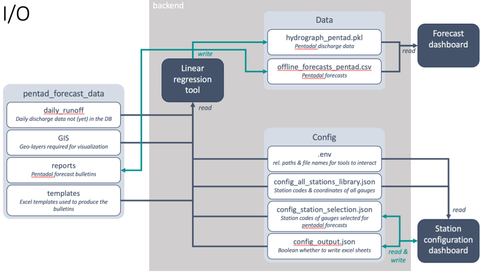

# Configuration

The different software components of the SAPPHIRE Forecast Tools interact with each other through input and output files (see following figure for an overview)

TODO: UPDATE FIGURE



## Configuration of the forecast tools
We recommend not changing the path ieasyforecast_configuration_path nor the names of the configuration files. You will need to edit the contents of the ieasyforecast_config_file_all_stations and make sure that the station codes given in ieasyforecast_config_file_station_selection are present also in ieasyforecast_config_file_all_stations. Please have a look at the example files in the config folder for guidance.
```
# Snipped of .env. We recommend NOT editing the following lines.
ieasyforecast_configuration_path=../config
ieasyforecast_config_file_all_stations=config_all_stations_library.json
ieasyforecast_config_file_station_selection=config_station_selection.json
ieasyforecast_config_file_output=config_output.json
```

### The config all stations library file
The SAPPHIRE forecast tools need to have an overview over which stations are available for forecasting. This information is stored in the config_all_stations_library.json file. The file is a list of dictionaries, where each dictionary contains information about one station. The station code is used as the key of the dictionary. Please note that the present version of the software it is assumed that gauge stations start with the character '1'. Currently, only the Russian river and site names are used in the forecast dashboard. Please refer to the file config/config_all_station_library.json for a working example. All entries marked with an * are exported by the iEasyHydro SKD library from the iEasyHydro database by default but the values are not used in the Forecast Tools. If you have to set up the all stations configuration file manually, you may use dummy data for the entries marked with *. The following information is stored for each station:
- *id (float): Site identifier exported from iEasyHydro SKD. Example value: 1.0
- basin (string): Name of the river basin. Example value: "Sihl"
- lat (float): Latitude of station. Example value: 47.368327
- long (float): Longitude of station. Example value: 8.527410
- *country (string): Name of the country the gauge is located. Example value: "Switzerland"
- *is_virtual (bool): Whether the station is a virtual station. Example value: false
- region (string): Name of the region the gauge is attributed to. Example value: "Mittelland"
- *site_type (string): Type of site. Example value: "automatic-discharge". Example value: "automatic-discharge"
- name_ru (string): Name of the gauge in Russian language. Example value: "Зиль - Цюрих, Зильхёльцли"
- *organization_id (int): Identifyer of organization. Example value: 1
- *elevation (float): Elevation in meters above mean sea level of gauge. Example value: 0.0
- river_ru (string): Name of the river in Russian. Example value: "Зиль"
- punkt_ru (string): Name of the gauge location in Russian. Example value: "Цюрих, Зильхёльцли"
- code (int): Gauge station code. Example value: 12176

### Intermediate results of the forecast tools
Intermediate results are written by the linear regression tool and read by the forecast dashboard. We recommend not changing the path ieasyforecast_intermediate_data_path nor the names of the intermediate files and we further recommend not manually editing any files in the path ieasyforecast_intermediate_data_path. The files are written by the backend tool and read by the forecast dashboard.
```
# Snipped of .env. We recommend NOT editing the following lines.
ieasyforecast_intermediate_data_path=../internal_data
ieasyforecast_hydrograph_day_file=hydrograph_day.pkl
ieasyforecast_hydrograph_pentad_file=hydrograph_pentad.pkl
ieasyforecast_results_file=offline_forecasts_pentad.csv
```
The backend further stores the date of the last successful run in the file ieasyforecast_last_successful_run_file. The file is stored under ieasyforecast_intermediate_data_path and is used to determine from which date the forecast should be run. It is updated by the backend.
```
# Snipped of .env. We recommend NOT editing the following lines.
ieasyforecast_last_successful_run_file=last_successful_run.txt
```

### Configuration of the forecast configuration dashboard
You will have to change the file name to match the administrative boundaries of your country. We recommend that you do not change the path ieasyforecast_gis_directory_path but rather copy your administrative boundary layers to ieasyforecast_gis_directory_path. You can use official shapefile layers by your countries administration or download publicly available layers from the [GADM website](https://gadm.org/data.html). The layers must be in the WGS84 coordinate system (EPSG:4326).
```
# In .env adapt the name of the administrative boundaries file to one of your country.
ieasyforecast_country_borders_file_name=gadm41_CHE_shp/gadm41_CHE_1.shp
```
Please note that we do not recommend changing the paths and names of the configuration files in apps/config.

### Configuration of the iEasyHydro SDK library
The SAPPHIRE Forecast Tools are designed to be able to use the iEasyHydro database (either the online or the locally installed version) as a source of discharge data. The iEasyHydro SDK library is used to access the iEasyHydro database. For the following instructions, we assume that you have access to the iEasyHydro database. If you do not have access, you should discuss with you IT administration.
```
# In .env_develop, configure the iEasyHydro SDK library to access your
# organizations iEasyHydro database.
IEASYHYDRO_HOST=http://localhost:9000
IEASYHYDRO_USERNAME=<user_name>
IEASYHYDRO_PASSWORD=<password>
ORGANIZATION_ID=1
```
You will need to adapt the port, user_name and password.

If you need to configure the forecast tools for the deployed version of the software, you will need to adapt the following lines in .env:
```
# In .env, configure the iEasyHydro SDK library to access your
# organizations iEasyHydro database.
IEASYHYDRO_HOST=http://host.docker.internal:9000
IEASYHYDRO_USERNAME=<user_name>
IEASYHYDRO_PASSWORD=<password>
ORGANIZATION_ID=1
```
You will need to adapt the port, user_name and password.

### Configuration of the iEasyReports library
The ieasyreports library reads a template file for a report, fills in the data for the current forecast and stores the data in a file. The path to the template directory is given in ieasyreports_templates_directory_path. The template for the traditional forecast bulletin with the overview over the rivers in one or several basins is given in ieasyforecast_template_pentad_bulletin_file. The template for the traditional forecast sheet with the detailed forecast for one station is given in ieasyforecast_template_pentad_sheet_file. Please consult the example files provided in the data/templates folder for guidance.
```
ieasyreports_templates_directory_path=../../data/templates
ieasyforecast_template_pentad_bulletin_file=pentad_forecast_bulletin_template.xlsx
ieasyforecast_template_pentad_sheet_file=short_term_trad_sheet_template.xlsx
```
Note that the forecast bulletin is always written but the forecast sheets are optional. Whether or not the forecast sheets are written by the forecast tools can be configured using the forecast dashboard. Advanced users can set 'write_excel' in the file config/config_output.json to false. The ieasyreports library uses tags to identify where the data should be inserted. The tags currently available in the forecast tools are listed here: [doc/bulletin_template_tags.md](bulletin_template_tags.md).

The root path where the forecast bulletins and the optional forecast sheets are written to in operational mode is given in ieasyreports_report_output_path. Currently, the bulletins are written to subfolders with the following structure:
ieasyreports_report_output_path/bulletins/pentad/<forecast_year>/<forecast_month>/<bulletin_for_forecast_pentad>.xlsx.
The forecast bulletins are named after forecast year, month and pentad. The forecast sheets are written to subfolders with the following structure:
ieasyreports_report_output_path/forecast_sheets/pentad/<forecast_year>/<forecast_month>/<station_code>/<forecast_sheet_for_forecast_pentad>.xlsx.
The forecast sheets are named after forecast year, month, pentad and station code. Please note that the forecast tools will add a prefix for the forecast year, month and pentad (and, in the case of the forecast sheets, the station code) to the base name. Please consult the example files provided in the data/reports folder for guidance.

```
# Path where the forecast bulletins are written to in operational mode
ieasyreports_report_output_path=../../data/reports
ieasyforecast_bulletin_file_name=pentadal_forecast_bulletin.xlsx
ieasyforecast_sheet_file_name=pentadal_forecast_sheet.xlsx
```
The base names for the output files is given in ieasyforecast_bulletin_file_name and ieasyforecast_sheet_file_name. The forecast tools will add a prefix for the forecast year, month and pentad (and, in the case of the forecast sheets, the station code) to the base name.

### Configuration for the configuration dashboard
For visualization of the stations on the map, the forecast configuration dashboard needs to know the path to the administrative boundaries file. The path is given in ieasyforecast_gis_directory_path. The name of the administrative boundaries file is given in ieasyforecast_country_borders_file_name. The file is stored in the path ieasyforecast_gis_directory_path. The file must be in the WGS84 coordinate system (EPSG:4326).
```
# Configuration of the assets for the station selection/configuration dashboard
ieasyforecast_gis_directory_path=../../data/GIS
ieasyforecast_country_borders_file_name=gadm41_CHE_shp/gadm41_CHE_1.shp
```
Please store your own administrative boundary file in the path ieasyforecast_gis_directory_path and adapt the name of the file in the .env file.

### Configuration for reading runoff data from excel
In addition to reading operational river runoff data from the iEasyHydro database, the forecast tools can read historical runoff data for each forecast station from excel files. The path to the excel file is given in ieasyforecast_daily_discharge_path.
```
ieasyforecast_daily_discharge_path=../../data/daily_runoff
```
Note that for each station selected for forecasting, the forecast tools will look for a file with the name <station_code_>*.xlsx in the path ieasyforecast_daily_discharge_path. The file must contain at least a sheet with the name '2000' and the following columns: 'date' and 'discharge'. The date column must contain the date in the format 'YYYY-MM-DD' and the discharge column must contain the discharge in m3/s. Please consult the example files provided in the data/daily_runoff folder for guidance. More detailed information abou thte input file format can be found in [doc/user_guide.md](user_guide.md), section Input data.

### Localization
The forecast dashboard can be configured to run in Russian or English. The ieasyforecast_locale_dir points to the directory with the translation files. The language for the dashboard is set in ieasyforecast_locale. Currently available locales are ru_KG and en_CH for Russian and English respectively.
```
# Path for localization of forecast dashboard
ieasyforecast_locale_dir=../config/locale
# Set the locale for the dashboard. Available locales are ru_KG and en_CH.
ieasyforecast_locale=ru_KG
```

### Configuration to facilitate testing of the tools
During development or deployment, you may want to focus only on selected stations. While all stations can be selected in the forecast configuration dashboard, you may want to limit the stations for which the actual forecast is produced. We use this option during the development of the forecast tools where we focus on a few stations for the implementation of the backend and the forecast dashboard. List the stations you wish to produce forecasts for in the file config_development_restrict_station_selection.json. The file has the same format as config_station_selection.json.
```
ieasyforecast_restrict_stations_file=../config/config_development_restrict_station_selection.json
```
For the deployment of the software or to not filter for a subset of the stations, you can set the value to null. The backend will check if the station selection is restricted and prints a warning to the console if this is the case so that it is not forgotten during deployment.


### Configuration of the preprocessing of weather data from the data gateway
The SAPPHIRE forecast tools can use weather data from ECMWF IFS and from the TopoPyScale-FSM snow model which is processed in the SAPPHIRE Data Gateway. See [TODO Chapter to be linked] for more information on the data gateway.

The preprocessing of weather data from the data gateway can only be done with a valid API key. If ieasyhydroforecast_API_KEY_GATEAWAY is not set or if it is not valid, the forecast tools will not be able to access the weather data from the data gateway and no forecasts with the machine learning models or with conceptual models will be produced. Forecasts using the linear regression method will still be produced.
```
# Configuration of the preprocessing of weather data from the data gateway

# API KEY FOR THE DATA-GATEAWAY
ieasyhydroforecast_API_KEY_GATEAWAY=<your private API key to the SAPPHIRE data gateway>
```
For installation instructions of the data gateway or possibilities of how to get access to an API key see [TODO Chapter to be linked].

It may happen that the names of the stations in the SAPPHIRE data gateway differ from the names of the stations in the iEasyHydro database. In this case, you can configure name twins in the file config_gateway_name_twins.json. The file is a dictionary where the key is the name of the station in the SAPPHIRE data gateway and the value is the name of the station in the iEasyHydro database. The file is optional and only needed if the names of the stations differ.
```
# Configuration of name twins if required. This file is optional.
ieasyhydroforecast_config_file_data_gateway_name_twins=config_gateway_name_twins.json
```

The preprocessing of data gateway will write output to the following paths.
TODO @Sandro: Please add a sentence to what is stored in these different folders.
```
# PATH FOR INTERMEDIATE RESULTS
# Subfolders located in ieasyforecast_intermediate_data_path
# Subfolders are created if they do not already exist
ieasyhydroforecast_OUTPUT_PATH_DG=data_gateway
ieasyhydroforecast_OUTPUT_PATH_CM=control_member_forcing
ieasyhydroforecast_OUTPUT_PATH_ENS=ensemble_forcing
```

We read parameters for downscaling of the ERA5-Land and ECMWF IFS forecasts, using the quantile mapping method, from the path defined in ieasyhydroforecast_models_and_scalers_path. Note that if there are no parameters for downscaling defined, the preprocessing of the data gateway module will write the raw ERA5-Land and ECMWF IFS forecasts to the path defined in ieasyhydroforecast_PATH_TO_QMAPPED_ERA5.
```
#PATH QUANTILE MAPPING
ieasyhydroforecast_models_and_scalers_path=../../data/config/models_and_scalers
ieasyhydroforecast_Q_MAP_PARAM_PATH=params_quantile_mapping
```

The outputs of the downscaling step are stored in the following paths:

```
ieasyhydroforecast_PATH_TO_QMAPPED_ERA5=control_member_forcing
```

In the following environment variables we configer which HRU file (uploaded to the SAPPHIRE Data Gateway) we download data for (variable ieasyhydroforecast_HRU_CONTROL_MEMBER). The control member is processed for each gauge defined in the HRU file. We further define which HRUs need an ensemble forecast (variable ieasyhydroforecast_HRU_ENSEMBLE). The ensemble forecast is processed for each gauge code defined in the HRU file.
```
# HRU FOR QUANTILE MAPPING AND FORECASTING
# Shapefile identifier to download data from the data gateway from
ieasyhydroforecast_HRU_CONTROL_MEMBER=00003
#Which HRUs (within ieasyhydroforecast_HRU_CONTROL_MEMBER) need an ensemble forecast
ieasyhydroforecast_HRU_ENSEMBLE=151940,16936
```