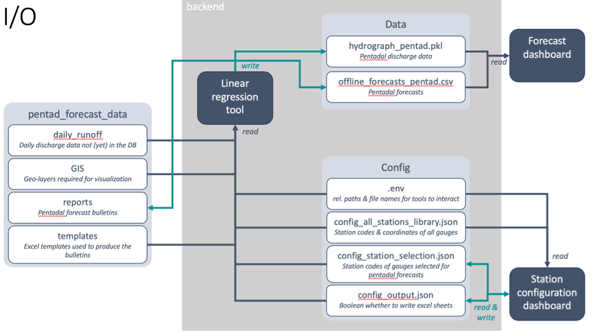

# Configuration

The different software components of the SAPPHIRE Forecast Tools interact with each other through input and output files (see following figure for an overview)

TODO: UPDATE FIGURE ...



## New deployment setup

To set up a new SAPPHIRE deployment, create a **data folder** outside the code repository with the following structure. The name convention is `<country_code>_data_forecast_tools` (e.g., `uzb_data_forecast_tools`).

```
<country>_data_forecast_tools/
├── config/                    # Station config and .env files
│   ├── .env_develop_<country> # Environment configuration (see sections below)
│   ├── config_all_stations_library.json
│   ├── config_station_selection.json
│   ├── config_output.json
│   ├── config_development_restrict_station_selection.json
│   └── locale/                # Copy from apps/config/locale/ for dashboard translations
├── daily_runoff/              # Excel files with historical discharge (one per station)
├── intermediate_data/         # Pipeline writes output here (created automatically)
├── GIS/                       # Administrative boundary shapefiles (for dashboard map)
├── templates/                 # Forecast bulletin Excel templates
└── reports/                   # Generated forecast bulletins (created automatically)
```

**Path convention**: All paths in the `.env` file are relative to the module working directory (`apps/<module>/`). For an external data folder sitting alongside the repository, use `../../../<country>_data_forecast_tools/` (three levels up from `apps/<module>/` to reach the shared parent directory).

#### Why three levels up

The pipeline scripts run with their working directory set to `apps/<module>/` (e.g. `apps/linear_regression/`). The repository and the data folder are siblings in a shared parent directory:

```
parent/                                  ← ../../../ from apps/<module>/
├── SAPPHIRE_Forecast_Tools/             ← the repository
│   ├── apps/
│   │   ├── linear_regression/           ← scripts run from here (cwd)
│   │   ├── preprocessing_runoff/
│   │   ├── machine_learning/
│   │   └── ...
│   ├── bin/
│   └── sapphire/
└── <country>_data_forecast_tools/       ← external data folder
    ├── config/
    │   └── <env_file>
    ├── daily_runoff/
    ├── intermediate_data/
    └── ...
```

Walking back up from `apps/linear_regression/`:

| `..` step | Lands in |
|-----------|----------|
| `..` | `apps/` |
| `../..` | `SAPPHIRE_Forecast_Tools/` |
| `../../..` | `parent/` (shared with the data folder) |

Concrete example: an `.env` line like

```bash
ieasyforecast_configuration_path=../../../<data_folder>/config
```

resolves to `parent/<country>_data_forecast_tools/config/` when a script runs from `apps/linear_regression/`, `apps/preprocessing_runoff/`, or any other module — the relative path is the same for all modules because they share the `apps/<module>/` depth.

If your deployment places the data folder somewhere else (e.g. a separate mount point, or at the same level as `SAPPHIRE_Forecast_Tools/`), adjust the `..` count accordingly. The rule is always "walk up until you hit the directory that contains your data folder, then descend in."

### .env variable reference

The `.env` file drives every pipeline module. Variables fall into three categories: **Required** (the pipeline will not start without them), **Required-if** (needed only when a specific feature or module is enabled), and **Optional** (sensible default, or the feature is simply off when unset). The pipeline-side variables live in the external data folder (e.g. `<data_folder>/config/.env_develop_<country>`); the services-side variables are loaded by the FastAPI stack. In production both sets share a single `.env` file — see [SAPPHIRE services (API stack)](deployment.md#sapphire-services-api-stack) in the deployment guide.

#### Minimal deployment profile

The minimal deployment runs linear regression against manual sites only — no iEasyHydro HF database, no SAPPHIRE Data Gateway, no ML models, no conceptual models, no long-term forecasts. Copy the block below into `<data_folder>/config/.env_develop_<country>`, replace the `<…>` placeholders, and the pipeline is runnable end-to-end. All other variables in the full reference table can be omitted.

```bash
# --- Identity and mode ---
ieasyhydroforecast_organization=demo
ieasyhydroforecast_connect_to_iEH=False
ieasyhydroforecast_run_ML_models=false
ieasyhydroforecast_run_CM_models=false

# --- Station + output config files (kept under <data_folder>/config) ---
ieasyforecast_configuration_path=../../../<data_folder>/config
ieasyforecast_config_file_all_stations=config_all_stations_library.json
ieasyforecast_config_file_station_selection=config_station_selection.json
ieasyforecast_config_file_output=config_output.json
ieasyforecast_restrict_stations_file=null

# --- Intermediate data + last-run marker ---
ieasyforecast_intermediate_data_path=../../../<data_folder>/intermediate_data
ieasyforecast_last_successful_run_file=last_successful_run.txt

# --- Bulletin templates and report output ---
ieasyreports_templates_directory_path=../../../<data_folder>/templates
ieasyforecast_template_pentad_bulletin_file=pentad_forecast_bulletin_template.xlsx
ieasyforecast_template_pentad_sheet_file=short_term_trad_sheet_template.xlsx
ieasyreports_report_output_path=../../../<data_folder>/reports
ieasyforecast_bulletin_file_name=pentadal_forecast_bulletin.xlsx
ieasyforecast_sheet_file_name=pentadal_forecast_sheet.xlsx

# --- Dashboard map + daily discharge excel files ---
ieasyforecast_gis_directory_path=../../../<data_folder>/GIS
ieasyforecast_country_borders_file_name=<adm_boundaries>.shp
ieasyforecast_daily_discharge_path=../../../<data_folder>/daily_runoff

# --- Localization + logging ---
ieasyforecast_locale_dir=../../../<data_folder>/config/locale
ieasyforecast_locale=en_CH
log_file=./forecast_logs.txt
log_level=INFO

# --- SAPPHIRE services (must point at the running API gateway) ---
SAPPHIRE_API_ENABLED=true
SAPPHIRE_API_URL=http://localhost:8000
POSTGRES_USER=<db_user>
POSTGRES_PASSWORD=<db_password>
PREPROCESSING_DB=preprocessing_db
POSTPROCESSING_DB=postprocessing_db
USER_DB=user_db
AUTH_DB=auth_db
JWT_SECRET_KEY=<generate_strong_random_secret>
```

For deployments that enable more features, keep the minimal block as the base and layer on the variables listed in ["Add-ons"](#add-ons--what-to-flip-on-when-you-need-more) below.

#### Full variable reference

Pipeline-side variables (set in the external `<data_folder>/config/.env_develop_<country>`):

| Variable | Category | Module(s) | Purpose | Default / Notes |
|----------|----------|-----------|---------|-----------------|
| `ieasyhydroforecast_organization` | Required | all | Deployment identifier (`demo`, `kghm`, `tjhm`, `uzhm`) | — |
| `ieasyhydroforecast_connect_to_iEH` | Required | all | `True`/`False` — toggles iEH HF SDK fetch | — |
| `ieasyhydroforecast_run_ML_models` | Required | dashboard, pipeline | `true`/`false` — gates ML forecast container | — |
| `ieasyhydroforecast_run_CM_models` | Required | dashboard, pipeline | `true`/`false` — gates conceptual-model container | — |
| `ieasyforecast_configuration_path` | Required | all | Path to station/output config JSON files | — |
| `ieasyforecast_config_file_all_stations` | Required | all | Station library filename | `config_all_stations_library.json` |
| `ieasyforecast_config_file_station_selection` | Required | all | Selected-stations filename | `config_station_selection.json` |
| `ieasyforecast_config_file_output` | Required | all | Output config filename | `config_output.json` |
| `ieasyforecast_intermediate_data_path` | Required | all | Where pipeline writes intermediate CSV/pkl | — |
| `ieasyforecast_last_successful_run_file` | Required | linear_regression | Marker file for last successful run date | `last_successful_run.txt` |
| `ieasyreports_templates_directory_path` | Required | postprocessing_forecasts | Bulletin/sheet template directory | — |
| `ieasyforecast_template_pentad_bulletin_file` | Required | postprocessing_forecasts | Pentad bulletin template filename | — |
| `ieasyforecast_template_pentad_sheet_file` | Required | postprocessing_forecasts | Pentad sheet template filename | — |
| `ieasyreports_report_output_path` | Required | postprocessing_forecasts | Root for generated bulletins/sheets | — |
| `ieasyforecast_bulletin_file_name` | Required | postprocessing_forecasts | Base name for pentad bulletins | — |
| `ieasyforecast_sheet_file_name` | Required | postprocessing_forecasts | Base name for pentad sheets | — |
| `ieasyforecast_gis_directory_path` | Required | dashboard | Directory holding admin boundary shapefiles | — |
| `ieasyforecast_country_borders_file_name` | Required | dashboard | Admin boundaries shapefile (WGS84, EPSG:4326) | — |
| `ieasyforecast_daily_discharge_path` | Required | preprocessing_runoff | Excel files with historical discharge | — |
| `ieasyforecast_locale_dir` | Required | dashboard | Directory with `.mo`/`.po` locale files | — |
| `ieasyforecast_locale` | Required | dashboard | Active locale (`ru_KG` or `en_CH`) | `en_CH` |
| `log_file` | Required | all | Log file path (relative to module cwd) | `./forecast_logs.txt` |
| `log_level` | Required | all | Python logging level | `INFO` |
| `SAPPHIRE_API_ENABLED` | Required | all | `true`/`false` — use API vs CSV-only | `true` |
| `SAPPHIRE_API_URL` | Required | all | API gateway base URL | `http://localhost:8000` |
| `ieasyforecast_restrict_stations_file` | Required-if: dev restriction | all | Restrict to subset of stations; `null` to disable | — |
| `ieasyhydroforecast_url` | Required-if: either dashboard origin below must be derived | dashboard | Base public domain, used by `bin/utils/common_functions.sh` to derive `ieasyhydroforecast_url_pentad` / `_decad` via hard-coded org prefixes when a deployment does not set them explicitly. Even when both explicit origins are set it is still dereferenced: `start_docker_compose_dashboards` (`bin/utils/common_functions.sh`, the `echo "| Deploying dashboard to: ...` line) always echoes it. | — |
| `ieasyhydroforecast_url_pentad` | Required-if: `ieasyhydroforecast_url` is not set | dashboard | Dashboard WebSocket allow-list for the pentadal dashboard. Comma-separated `HOST[:PORT]` entries, no scheme (e.g. `host.example:5006`). **Rule**: the entry must match the port shown in the **browser's address bar**, not the port Panel listens on — getting this backwards is the most common misconfiguration. Direct access (LAN): `10.0.0.1:5006`. Behind an https reverse proxy: `fc.pentad.example.org` (no port). Validated (and lowercased, with any leading zero stripped from the port) by `validate_dashboard_origins()`, but only on the three **scripted** launchers (`bin/restart_sapphire_stack.sh`, `bin/daily_update_sapphire_frontend.sh`, `bin/deploy_sapphire_forecast_tools.sh`) — a direct `docker compose ... up` against `sapphire/docker-compose.yml` or `bin/docker-compose-dashboards.yml` (as several documented procedures do) reads the value straight from the env file with no validation at all. | Derived from `ieasyhydroforecast_url` by `common_functions.sh` if unset or empty |
| `ieasyhydroforecast_url_decad` | Required-if: `ieasyhydroforecast_url` is not set | dashboard | Dashboard WebSocket allow-list for the decadal dashboard. Same value form and rule as `_pentad` above — match what the browser sends, not the port Panel listens on. Direct access (LAN): `10.0.0.1:5007`. Behind an https reverse proxy: `fc.decad.example.org` (no port). **Validated where it is unused, and unvalidated where it is used**: `validate_dashboard_origins()` checks `_pentad` and `_decad` together, so the three scripted launchers do validate `_decad` — but none of those three ever starts the decadal dashboard container (`grep docker-compose-dashboards.yml bin/` finds `down` calls, no `up`). The decadal dashboard's only start path is the manual `docker compose -f bin/docker-compose-dashboards.yml ... up -d decaddashboard` command in [`doc/deployment.md`](deployment.md#dashboards), which does not call `validate_dashboard_origins()`. | Derived from `ieasyhydroforecast_url` by `common_functions.sh` if unset or empty |
| `IEASYHYDROHF_HOST` | Required-if: `connect_to_iEH=True` | preprocessing_runoff | iEasyHydro HF API endpoint (e.g. `http://host.docker.internal:5555/api/v1/`) | — |
| `IEASYHYDROHF_USERNAME` | Required-if: `connect_to_iEH=True` | preprocessing_runoff | iEH HF API username | — |
| `IEASYHYDROHF_PASSWORD` | Required-if: `connect_to_iEH=True` | preprocessing_runoff | iEH HF API password | — |
| `ieasyhydroforecast_ssh_to_iEH` | Required-if: SSH tunnel to iEH | preprocessing_runoff | `True` if reaching iEH through an SSH tunnel | `False` |
| `IEASYHYDRO_HOST` | Required-if: legacy iEH SDK | backend (legacy) | Legacy iEasyHydro (non-HF) endpoint | — |
| `IEASYHYDRO_USERNAME` | Required-if: legacy iEH SDK | backend (legacy) | Legacy iEH username | — |
| `IEASYHYDRO_PASSWORD` | Required-if: legacy iEH SDK | backend (legacy) | Legacy iEH password | — |
| `ORGANIZATION_ID` | Required-if: legacy iEH SDK | backend (legacy) | Organization ID in legacy iEH | `1` |
| `IEASYHYDRO_SPOTCHECK_SITES` | Required-if: spot-check enabled | preprocessing_runoff | Comma-separated site codes to spot-check | — |
| `GOOGLE_SHEETS_ENABLED` | Required-if: manual-site sheet ingestion | preprocessing_runoff | `true`/`false` | `false` |
| `GOOGLE_SHEETS_DISCHARGE_ID` | Required-if: `GOOGLE_SHEETS_ENABLED=true` | preprocessing_runoff | Spreadsheet ID | — |
| `GOOGLE_SHEETS_CREDENTIALS_PATH` | Required-if: `GOOGLE_SHEETS_ENABLED=true` | preprocessing_runoff | Path to Google service account JSON key | — |
| `GOOGLE_SHEETS_SITE_CODES` | Required-if: `GOOGLE_SHEETS_ENABLED=true` | preprocessing_runoff | Comma-separated manual site codes | — |
| `ieasyhydroforecast_API_KEY_GATEAWAY` | Required-if: gateway used | preprocessing_gateway, ML, conceptual | API key for SAPPHIRE Data Gateway | — |
| `SAPPHIRE_DG_HOST` | Required-if: gateway used | preprocessing_gateway, dashboard | Gateway base URL | — |
| `SAPPHIRE_DG_API_KEY` | Required-if: gateway used | preprocessing_gateway | Gateway API key (alternative name) | — |
| `ieasyhydroforecast_HRU_CONTROL_MEMBER` | Required-if: gateway used | preprocessing_gateway | HRU shapefile identifier for control member | — |
| `ieasyhydroforecast_HRU_ENSEMBLE` | Required-if: gateway used | preprocessing_gateway | Comma-separated HRUs needing ensemble forecasts | — |
| `ieasyhydroforecast_OUTPUT_PATH_DG` | Required-if: gateway used | preprocessing_gateway | Subdir under intermediate for gateway output | `data_gateway` |
| `ieasyhydroforecast_OUTPUT_PATH_CM` | Required-if: gateway used | preprocessing_gateway | Subdir for control-member forcing | `control_member_forcing` |
| `ieasyhydroforecast_OUTPUT_PATH_ENS` | Required-if: gateway used | preprocessing_gateway | Subdir for ensemble forcing | `ensemble_forcing` |
| `ieasyhydroforecast_OUTPUT_PATH_REANALYSIS` | Required-if: gateway used | preprocessing_gateway | Subdir for ERA5 reanalysis output | — |
| `ieasyhydroforecast_OUTPUT_PATH_SNOW` | Required-if: gateway used | preprocessing_gateway | Subdir for snow data output | — |
| `ieasyhydroforecast_OUTPUT_PATH_DISCHARGE` | Required-if: ML used | ML | Subdir for ML prediction output | `predictions` |
| `ieasyhydroforecast_models_and_scalers_path` | Required-if: ML or quantile mapping | preprocessing_gateway, ML | Path to trained scalers / QM params | — |
| `ieasyhydroforecast_Q_MAP_PARAM_PATH` | Required-if: quantile mapping | preprocessing_gateway | Subdir under models_and_scalers for QM params | `params_quantile_mapping` |
| `ieasyhydroforecast_PATH_TO_QMAPPED_ERA5` | Required-if: gateway used | preprocessing_gateway | Output subdir for QMapped ERA5 | `control_member_forcing` |
| `ieasyhydroforecast_available_ML_models` | Required-if: `run_ML_models=true` | ML, dashboard | Comma-separated model tags | `TFT,TIDE,TSMIXER` |
| `ieasyhydroforecast_config_hydroposts_available_for_ml_forecasts` | Required-if: `run_ML_models=true` | ML | JSON listing hydroposts eligible for ML | — |
| `ieasyhydroforecast_ml_hru_models` | Required-if: `run_ML_models=true` | ML | Mapping from model → HRU | — |
| `ieasyhydroforecast_SNOW_VARS` | Required-if: snow data used | preprocessing_gateway, long_term | Comma-separated snow vars (e.g. `SWE,HS,RoF`) | — |
| `ieasyhydroforecast_HRU_SNOW_DATA` | Required-if: snow data used | preprocessing_gateway | HRU id for snow data | — |
| `ieasyhydroforecast_HRU_SNOW_DATA_DASHBOARD` | Required-if: snow in dashboard | dashboard | HRU id exposed on snow visualization | — |
| `ieasyhydroforecast_ECMWF_IFS_lead_time` | Required-if: ML used | ML | Forecast lead time in days for IFS | — |
| `ieasyhydroforecast_NEW_STATIONS` | Required-if: onboarding new stations | preprocessing_gateway, ML | Comma-separated codes for backfill | — |
| `ieasyhydroforecast_ml_long_term_configuration` | Required-if: long_term used | long_term | Path to long-term forecast config JSON | — |
| `ieasyhydroforecast_ml_long_term_output_path` | Required-if: long_term used | long_term | Output subdir under intermediate data | — |
| `ieasyhydroforecast_ml_long_term_path_to_static` | Required-if: long_term used | long_term | Static features CSV for long-term models | — |
| `ieasyhydroforecast_ml_long_term_supported_modes` | Required-if: long_term used | long_term | Comma-separated modes (e.g. `month_1,seasonal`) | — |
| `lt_forecast_mode` | Required-if: long_term used | long_term | Mode selected for a given run | — |
| `SAPPHIRE_PIPELINE_SMTP_SERVER` | Required-if: email alerts | pipeline | SMTP host | `smtp.example.com` |
| `SAPPHIRE_PIPELINE_SMTP_PORT` | Required-if: email alerts | pipeline | SMTP port | `587` |
| `SAPPHIRE_PIPELINE_SMTP_USERNAME` | Required-if: email alerts | pipeline | SMTP login | — |
| `SAPPHIRE_PIPELINE_SMTP_PASSWORD` | Required-if: email alerts | pipeline | SMTP password | — |
| `DOCKER_MONITOR_ENV_PATH` | Required-if: Phase 11 monitoring | monitoring | Absolute host-side path to the deployment's env file, passed to `bin/monitoring/docker.sh` and `docker_log_watcher.sh` via the systemd unit's `Environment=` directive | Falls back to `./apps/config/.env` (does not exist at systemd's working dir) |
| `SAPPHIRE_PIPELINE_SENDER_EMAIL` | Required-if: email alerts | pipeline | From-address for pipeline alerts | — |
| `SAPPHIRE_PIPELINE_EMAIL_RECIPIENTS` | Required-if: email alerts | pipeline | Comma-separated recipient list | — |
| `ieasyhydroforecast_config_file_data_gateway_name_twins` | Optional | preprocessing_gateway | JSON mapping gateway-name → iEH-name | — |
| `ieasyforecast_hydrograph_day_file` | Optional | linear_regression, dashboard | Daily hydrograph filename | `hydrograph_day.csv` |
| `ieasyforecast_hydrograph_pentad_file` | Optional | linear_regression, dashboard | Pentad hydrograph filename | `hydrograph_pentad.csv` |
| `ieasyforecast_hydrograph_decad_file` | Optional | linear_regression, dashboard | Decad hydrograph filename | `hydrograph_decad.csv` |
| `ieasyforecast_pentad_results_file` | Optional | linear_regression | Pentad forecast CSV filename | `forecasts_pentad.csv` |
| `ieasyforecast_decad_results_file` | Optional | linear_regression | Decad forecast CSV filename | `forecasts_decad.csv` |
| `ieasyforecast_daily_discharge_file` | Optional | preprocessing_runoff | Daily discharge CSV filename | `runoff_day.csv` |
| `ieasyforecast_pentad_discharge_file` | Optional | linear_regression | Pentad runoff CSV filename | `runoff_pentad.csv` |
| `ieasyforecast_decad_discharge_file` | Optional | linear_regression | Decad runoff CSV filename | `runoff_decad.csv` |
| `ieasyforecast_analysis_pentad_file` | Optional | linear_regression | Pentad analysis CSV | `forecast_pentad_linreg.csv` |
| `ieasyforecast_analysis_decad_file` | Optional | linear_regression | Decad analysis CSV | `forecast_decad_linreg.csv` |
| `ieasyforecast_pentadal_skill_metrics_file` | Optional | postprocessing_forecasts | Pentad skill CSV backup filename | `skill_metrics_pentad.csv` |
| `ieasyforecast_decadal_skill_metrics_file` | Optional | postprocessing_forecasts | Decad skill CSV backup filename | `skill_metrics_decad.csv` |
| `ieasyforecast_monthly_skill_metrics_file` | Optional | postprocessing_forecasts | Monthly skill CSV backup filename | `skill_metrics_monthly.csv` |
| `ieasyforecast_combined_forecast_pentad_file` | Optional | postprocessing_forecasts | Combined pentad forecast CSV | `combined_forecasts_pentad.csv` |
| `ieasyforecast_combined_forecast_decad_file` | Optional | postprocessing_forecasts | Combined decad forecast CSV | `combined_forecasts_decad.csv` |
| `ieasyforecast_monthly_combined_forecast_file` | Optional | postprocessing_forecasts | Monthly combined forecast CSV | `combined_forecasts_monthly.csv` |
| `ieasyforecast_template_decad_bulletin_file` | Optional | postprocessing_forecasts | Decad bulletin template | — |
| `ieasyforecast_template_decad_sheet_file` | Optional | postprocessing_forecasts | Decad sheet template | — |
| `ieasyhydroforecast_backend_docker_image_tag` | Optional | dashboard (triggers) | Docker tag for backend images | `latest` |
| `ieasyhydroforecast_frontend_docker_image_tag` | Optional | dashboard | Docker tag for frontend | `latest` |
| `ieasyhydroforecast_data_root_dir` | Optional | dashboard (Docker triggers) | Host path of `<data_folder>` for Docker binds | — |
| `ieasyhydroforecast_bin_path` | Optional | dashboard (Docker triggers) | Host path to `bin/` for Docker binds | — |
| `ieasyhydroforecast_env_file_path` | Optional | run_locally.sh | Absolute path to `.env` (required by `run_locally.sh`) | — |
| `ieasyhydroforecast_START_DATE` | Optional | linear_regression, long_term | Hindcast start date (YYYY-MM-DD) | — |
| `ieasyhydroforecast_END_DATE` | Optional | linear_regression, long_term | Hindcast end date (YYYY-MM-DD) | — |
| `ieasyhydroforecast_reanalysis_START_DATE` | Optional | preprocessing_gateway | ERA5 reanalysis window start | — |
| `ieasyhydroforecast_reanalysis_END_DATE` | Optional | preprocessing_gateway | ERA5 reanalysis window end | — |
| `ieasyhydroforecast_CODES_HINDECAST` | Optional | ML, long_term | Codes to hindcast | — |
| `ieasyhydroforecast_SNOW_DISPLAY_START_MMDD` | Optional | dashboard | Snow viz start day (MM-DD) | — |
| `SAPPHIRE_API_TOKEN` | Optional | all | Bearer token for API gateway | — |
| `SAPPHIRE_API_FAILURE_MODE` | Optional | all | Failure policy when API unreachable (`warn`/`fail`) | `warn` |
| `SAPPHIRE_SYNC_MODE` | Optional | preprocessing_gateway | `operational` or `historical` | `operational` |
| `SAPPHIRE_CONSISTENCY_CHECK` | Optional | preprocessing_gateway | `true`/`false` — enable data consistency check | `false` |
| `SAPPHIRE_CONSISTENCY_STRICT` | Optional | preprocessing_gateway | Fail on consistency mismatch | `false` |
| `SAPPHIRE_SKILL_METRICS_START_YEAR` | Optional | postprocessing_forecasts | Override rolling window start year | current year − 20 |
| `SAPPHIRE_SKILL_METRICS_YEAR` | Optional | postprocessing_forecasts | Target year for recalculation run | — |
| `SAPPHIRE_RECALC_START_YEAR` | Optional | postprocessing_forecasts | Skill recalc window start | — |
| `SAPPHIRE_RECALC_END_YEAR` | Optional | postprocessing_forecasts | Skill recalc window end | — |
| `ieasyhydroforecast_efficiency_threshold` | Optional | postprocessing_forecasts | **Short-term** ensemble admission: keep models with `sdivsigma` ≤ threshold | `0.6` |
| `ieasyhydroforecast_nse_threshold` | Optional | postprocessing_forecasts | **Short-term** ensemble admission: keep models with `NSE` ≥ threshold | `0.8` |
| `ieasyhydroforecast_accuracy_threshold` | Optional | postprocessing_forecasts | **Short-term** ensemble admission: keep models with `accuracy` ≥ threshold | `0.8` |
| `ieasyhydroforecast_nse_threshold_long_term` | Optional | postprocessing_forecasts | **Long-term** (month/quarter/season) Skilled-Mean admission: keep models with `NSE` ≥ threshold | `1e-9` (i.e. NSE > 0) |
| `ieasyhydroforecast_efficiency_threshold_long_term` | Optional | postprocessing_forecasts | **Long-term** `sdivsigma` gate | `False` (gate disabled) |
| `ieasyhydroforecast_accuracy_threshold_long_term` | Optional | postprocessing_forecasts | **Long-term** `accuracy` gate | `False` (gate disabled) |
| `ieasyhydroforecast_min_pairs_long_term` | Optional | postprocessing_forecasts | Minimum forecast/observation pairs for a **monthly** long-term skill row to be usable | `4` |
| `ieasyhydroforecast_min_pairs_long_term_quarter` | Optional | postprocessing_forecasts | Same floor, **quarterly** | `5` |
| `ieasyhydroforecast_min_pairs_long_term_season` | Optional | postprocessing_forecasts | Same floor, **seasonal** | `5` |
| `SAPPHIRE_SEASON_START_MONTH` | Optional | long_term | Hydrological season start month | — |
| `SAPPHIRE_SEASON_END_MONTH` | Optional | long_term | Hydrological season end month | — |
| `SAPPHIRE_HINDCAST_MODE` | Optional | ML, long_term | Enable hindcast code paths | — |
| `SAPPHIRE_HINDCAST_TIMEOUT_SECONDS` | Optional | ML | ML hindcast container timeout | — |
| `SAPPHIRE_MODEL_TO_USE` | Optional | long_term | Model override for a single run | — |
| `FRESHNESS_THRESHOLD_DAYS` | Optional | validate_pipeline | Warn if intermediate data older than N days | `7` |
| `POSTPROCESSING_GAPFILL_MAX_MONTHS` | Optional | postprocessing_forecasts | Max months to gap-fill | — |
| `POSTPROCESSING_GAPFILL_WINDOW_DAYS` | Optional | postprocessing_forecasts | Gap-fill window (days) | — |
| `POSTPROCESSING_GAPFILL_WINDOW_MONTHS` | Optional | postprocessing_forecasts | Gap-fill window (months) | — |
| `POSTPROCESSING_GAPFILL_WINDOW_QUARTERS` | Optional | postprocessing_forecasts | Gap-fill window (quarters) | — |
| `POSTPROCESSING_GAPFILL_WINDOW_SEASONS` | Optional | postprocessing_forecasts | Gap-fill window (seasons) | — |
| `PREPROCESSING_MAINTENANCE_LOOKBACK_DAYS` | Optional | preprocessing_runoff | Maintenance pipeline lookback | — |

Services-side variables (loaded by the FastAPI stack — in production they sit in the same `.env` as above; `sapphire/.env.example` is the reference). See [SAPPHIRE services (API stack)](deployment.md#sapphire-services-api-stack):

| Variable | Category | Module(s) | Purpose | Default / Notes |
|----------|----------|-----------|---------|-----------------|
| `POSTGRES_USER` | Required | services | Postgres superuser for all service DBs | — |
| `POSTGRES_PASSWORD` | Required | services | Postgres password | — |
| `PREPROCESSING_DB` | Required | services | Preprocessing DB name | `preprocessing_db` |
| `POSTPROCESSING_DB` | Required | services | Postprocessing DB name | `postprocessing_db` |
| `USER_DB` | Required | services | User DB name | `user_db` |
| `AUTH_DB` | Required | services | Auth DB name | `auth_db` |
| `PREPROCESSING_DATABASE_URL` | Required | services | SQLAlchemy URL for preprocessing DB | Built from above |
| `POSTPROCESSING_DATABASE_URL` | Required | services | SQLAlchemy URL for postprocessing DB | Built from above |
| `USER_DATABASE_URL` | Required | services | SQLAlchemy URL for user DB | Built from above |
| `AUTH_DATABASE_URL` | Required | services | SQLAlchemy URL for auth DB | Built from above |
| `PREPROCESSING_API_URL` | Required | services | Internal URL the gateway uses for preprocessing | `http://preprocessing-api:8002` |
| `POSTPROCESSING_API_URL` | Required | services | Internal URL for postprocessing | `http://postprocessing-api:8003` |
| `USER_API_URL` | Required | services | Internal URL for user service | `http://user-api:8004` |
| `AUTH_API_URL` | Required | services | Internal URL for auth service | `http://auth-api:8005` |
| `JWT_SECRET_KEY` | Required | services | Signing key for JWT tokens (generate random) | — |
| `JWT_ALGORITHM` | Optional | services | JWT algorithm | `HS256` |
| `ACCESS_TOKEN_EXPIRE_MINUTES` | Optional | services | Access token lifetime | `30` |
| `REFRESH_TOKEN_EXPIRE_DAYS` | Optional | services | Refresh token lifetime | `7` |
| `REQUEST_TIMEOUT` | Optional | services | API gateway request timeout (s) | `30` |
| `HEALTH_CHECK_TIMEOUT` | Optional | services | Health-check timeout (s) | `5` |
| `API_KEY_ENABLED` | Optional | services | Enable API-key protection on gateway | `false` |
| `API_KEY` | Required-if: `API_KEY_ENABLED=true` | services | Gateway API key | — |
| `RATE_LIMIT_ENABLED` | Optional | services | Enable rate limiting | `false` |
| `RATE_LIMIT` | Optional | services | Requests per minute when enabled | `100` |
| `LOG_LEVEL` | Optional | services | Services log level | `INFO` |
| `BATCH_SIZE` | Optional | services | Default batch size for migrations | `1000` |
| `CSV_FOLDER` | Optional | services | CSV folder mounted into services | — |
| `INTERMEDIATE_DATA_PATH` | Optional | services | Path to intermediate data (container side) | — |
| `CONFIG_PATH` | Optional | services | Path to config (container side) | — |
| `CONFIG_FOLDER` | Optional | services | Mount point inside containers | `/config` |
| `PUBLIC_BULLETIN_BASE_URL` | Optional | services (postprocessing) | Public HTTPS base used to build shareable bulletin-share links returned by `POST /bulletin/share` (e.g. `https://<gateway-host>`). Set to the internet-reachable gateway host in production; the default only yields localhost links. | `http://localhost:8000` |

Internal / Docker-only variables injected by the dashboard or Luigi at runtime (`SAPPHIRE_FORECAST_DATE`, `SAPPHIRE_PREDICTION_MODE`, `IN_DOCKER_CONTAINER`, `SAPPHIRE_OPDEV_ENV`) are documented separately under [Internal Docker environment variables](#internal-docker-environment-variables) and are not meant to be set in `.env`.

#### Add-ons — what to flip on when you need more

- **Connect to iEasyHydro HF.** Set `ieasyhydroforecast_connect_to_iEH=True`. Also set `IEASYHYDROHF_HOST`, `IEASYHYDROHF_USERNAME`, `IEASYHYDROHF_PASSWORD`. Add `ieasyhydroforecast_ssh_to_iEH=True` if reaching the HF API through an SSH tunnel.
- **Legacy iEasyHydro SDK (non-HF).** Distinct from the HF variables above. Set `IEASYHYDRO_HOST`, `IEASYHYDRO_USERNAME`, `IEASYHYDRO_PASSWORD`, `ORGANIZATION_ID`. Used by the legacy `backend/` module only.
- **SAPPHIRE Data Gateway.** Set `ieasyhydroforecast_API_KEY_GATEAWAY`, `SAPPHIRE_DG_HOST`, `ieasyhydroforecast_HRU_CONTROL_MEMBER`, `ieasyhydroforecast_models_and_scalers_path`. Required before enabling ML or conceptual models.
- **ML models.** Set `ieasyhydroforecast_run_ML_models=true`. Also set the gateway block above, plus `ieasyhydroforecast_available_ML_models`, `ieasyhydroforecast_config_hydroposts_available_for_ml_forecasts`, `ieasyhydroforecast_ml_hru_models`, `ieasyhydroforecast_ECMWF_IFS_lead_time`.
- **Long-term monthly forecasts.** Set `ieasyhydroforecast_ml_long_term_configuration`, `ieasyhydroforecast_ml_long_term_output_path`, `ieasyhydroforecast_ml_long_term_path_to_static`, `ieasyhydroforecast_ml_long_term_supported_modes`. Gateway block is also required if the models consume weather forcing.
- **Conceptual rainfall-runoff.** Set `ieasyhydroforecast_run_CM_models=true`. Also set the gateway block plus the conceptual-model paths documented in [Configuration of the conceptual rainfall-runoff module](#configuration-of-the-conceptual-rainfall-runoff-module) below.
- **Manual-site ingestion from Google Sheets.** Set `GOOGLE_SHEETS_ENABLED=true`. Also set `GOOGLE_SHEETS_DISCHARGE_ID`, `GOOGLE_SHEETS_CREDENTIALS_PATH`, `GOOGLE_SHEETS_SITE_CODES`. Sites must be marked `"data_source": ["manual"]` in `config_all_stations_library.json` (list form is the canonical convention used by `setup_library.py`; a plain string `"manual"` is also accepted).
- **Email alerts on pipeline failure.** Set `SAPPHIRE_PIPELINE_SMTP_SERVER`, `SAPPHIRE_PIPELINE_SMTP_PORT`, `SAPPHIRE_PIPELINE_SMTP_USERNAME`, `SAPPHIRE_PIPELINE_SMTP_PASSWORD`, `SAPPHIRE_PIPELINE_SENDER_EMAIL`, `SAPPHIRE_PIPELINE_EMAIL_RECIPIENTS`.
- **Spot-check validation of iEH HF data.** Set `IEASYHYDRO_SPOTCHECK_SITES` to a comma-separated list of site codes (e.g. `19999,19998`).

#### Ensemble admission thresholds (short-term vs long-term)

Ensemble aggregates admit member models by skill. **Short-term and long-term use separate
variables** — the names differ only by a `_long_term` suffix, so they are easy to confuse. All
have working defaults; a deployment needs an entry only to deliberately override one.

| Metric | Short-term (pentad / decad) | Long-term (month / quarter / season) |
|---|---|---|
| `sdivsigma` | `ieasyhydroforecast_efficiency_threshold` (`0.6`) | `ieasyhydroforecast_efficiency_threshold_long_term` (disabled) |
| `NSE` | `ieasyhydroforecast_nse_threshold` (`0.8`) | `ieasyhydroforecast_nse_threshold_long_term` (`1e-9`) |
| `accuracy` | `ieasyhydroforecast_accuracy_threshold` (`0.8`) | `ieasyhydroforecast_accuracy_threshold_long_term` (disabled) |
| minimum pairs | — | `ieasyhydroforecast_min_pairs_long_term` (`4`), `..._quarter` (`5`), `..._season` (`5`) |

Three details that are not obvious from the values alone:

- **`False` disables a gate entirely.** Accepted disable tokens are, case-insensitively:
  `false`, `off`, `none`, `disable`, `disabled`, and the empty string. That is why two of the
  long-term defaults read `False` rather than a number.
- **The long-term NSE default is `1e-9`, not `0`.** The comparison is inclusive (`>=`), so an
  exact `0.0` would pass a gate meant to read "NSE greater than zero". The epsilon enforces
  *strictly* positive skill — i.e. exclude any model no better than climatology.
- **The long-term metric thresholds apply to all three long-term horizons**; only the
  minimum-pairs floor is per-horizon. Quarter and season draw on just two candidate models, so
  there a threshold acts as an on/off switch for the whole aggregate rather than a way to select
  among members — raising it above "NSE > 0" suppresses the product instead of refining it.

Which aggregate uses which gate:

| Aggregate | Horizon | Admission |
|---|---|---|
| EM | pentad / decad | short-term thresholds, ≥2 qualifying models |
| EM | month | short-term thresholds + monthly min-pairs — sparse by design, and **not** the intended long-term product |
| EM | quarter / season | **no skill gate** — fixed `LR_Base` + `LR_SM` aggregate |
| **Skilled Mean** | month / quarter / season | **long-term thresholds** — the intended long-term aggregate |
| Naive Mean | all | **no skill gate**; needs ≥2 members with a non-null point forecast |

## Configuration of the forecast tools
We recommend not changing the path ieasyforecast_configuration_path nor the names of the configuration files. You will need to edit the contents of the ieasyforecast_config_file_all_stations and make sure that the station codes given in ieasyforecast_config_file_station_selection are present also in ieasyforecast_config_file_all_stations. Please have a look at the example files in the config folder for guidance.
```
# Path to the configuration files and names of the configuration files
ieasyforecast_configuration_path=../config
ieasyforecast_config_file_all_stations=config_all_stations_library.json
ieasyforecast_config_file_station_selection=config_station_selection.json
ieasyforecast_config_file_output=config_output.json
```

### The config all stations library file
The SAPPHIRE forecast tools need to have an overview over which stations are available for forecasting. This information is stored in the config_all_stations_library.json file. The file is a dictionary of station entries, where each station code is used as the key. Station codes must be numeric strings starting with the digit `1` (e.g., `12176`, `10001`).

Currently, only the Russian river and site names are used in the forecast dashboard. Please refer to the file config/config_all_station_library.json for a working example. All entries marked with an * are exported by the iEasyHydro SDK library from the iEasyHydro database by default but the values are not used in the Forecast Tools. If you have to set up the all stations configuration file manually, you may use dummy data for the entries marked with *.

**All values are stored as single-element lists** (e.g., `"lat": [47.37]`, `"name_ru": ["Station Name"]`). This is a convention used throughout the config system.

The following information is stored for each station:

**Required fields** (pipeline raises `ValueError` if missing):
- code (int): Gauge station code. Example value: 12176
- name_ru (string): Name of the gauge. Example value: "Зиль - Цюрих, Зильхёльцли"
- river_ru (string): Name of the river. Example value: "Зиль"
- punkt_ru (string): Name of the gauge location. Example value: "Цюрих, Зильхёльцли"
- lat (float): Latitude of station. Example value: 47.368327
- long (float): Longitude of station. Example value: 8.527410
- region (string): Name of the region. Example value: "Mittelland"
- basin (string): Name of the river basin. Example value: "Rhein"

**Optional fields** (exported by iEasyHydro SDK — use dummy values if setting up manually):
- *id (float): Site identifier from iEasyHydro. Example value: 1.0
- *country (string): Country name. Example value: "Switzerland"
- *is_virtual (bool): Whether the station is virtual. Example value: false
- *site_type (string): Type of site. Example value: "automatic-discharge"
- *organization_id (int): Organization identifier. Example value: 1
- *elevation (float): Elevation in meters above sea level. Example value: 0.0

**Data source field** (for manual sites):
- data_source (string): Controls how the pipeline manages this station. Values:
  - `"ieh_hf"` or absent: Station is managed by iEasyHydro HF SDK (normal behavior)
  - `"manual"`: Station is protected from config refresh overwrites and its discharge data comes from Google Sheets (if configured) rather than the iEH HF database

Example manual site entry:
```json
"10001": {
    "data_source": ["manual"],
    "code": [10001],
    "name_ru": ["Test River - Test Location"],
    "river_ru": ["Test River"],
    "punkt_ru": ["Test Location"],
    "lat": [41.3],
    "long": [69.3],
    "basin": ["Syrdarya"],
    "region": ["Tashkent"]
}
```

### Intermediate results of the forecast tools
Intermediate results are written by the linear regression tool and read by the forecast dashboard. We recommend not changing the path ieasyforecast_intermediate_data_path nor the names of the intermediate files and we further recommend not manually editing any files in the path ieasyforecast_intermediate_data_path. The files are written by the backend tool and read by the forecast dashboard.
```
# Snipped of .env. We recommend NOT editing the following lines.
ieasyforecast_intermediate_data_path=../internal_data
ieasyforecast_hydrograph_day_file=hydrograph_day.pkl
ieasyforecast_hydrograph_pentad_file=hydrograph_pentad.pkl
ieasyforecast_results_file=offline_forecasts_pentad.csv
```
The backend further stores the date of the last successful run in the file ieasyforecast_last_successful_run_file. The file is stored under ieasyforecast_intermediate_data_path and is used to determine from which date the forecast should be run. It is updated by the backend.
```
# Snipped of .env. We recommend NOT editing the following lines.
ieasyforecast_last_successful_run_file=last_successful_run.txt
```

### Configuration of the forecast configuration dashboard
You will have to change the file name to match the administrative boundaries of your country. We recommend that you do not change the path ieasyforecast_gis_directory_path but rather copy your administrative boundary layers to ieasyforecast_gis_directory_path. You can use official shapefile layers by your countries administration or download publicly available layers from the [GADM website](https://gadm.org/data.html). The layers must be in the WGS84 coordinate system (EPSG:4326).
```
# In .env adapt the name of the administrative boundaries file to one of your country.
ieasyforecast_country_borders_file_name=gadm41_CHE_shp/gadm41_CHE_1.shp
```
Please note that we do not recommend changing the paths and names of the configuration files in apps/config.

### Configuration of the iEasyHydro SDK library
The SAPPHIRE Forecast Tools are designed to be able to use the iEasyHydro database (either the online or the locally installed version) as a source of discharge data. The iEasyHydro SDK library is used to access the iEasyHydro database. For the following instructions, we assume that you have access to the iEasyHydro database. If you do not have access, you should discuss with you IT administration.
```
# In .env_develop, configure the iEasyHydro SDK library to access your
# organizations iEasyHydro database.
IEASYHYDRO_HOST=http://localhost:9000
IEASYHYDRO_USERNAME=<user_name>
IEASYHYDRO_PASSWORD=<password>
ORGANIZATION_ID=1
```
You will need to adapt the port, user_name and password.

If you need to configure the forecast tools for the deployed version of the software, you will need to adapt the following lines in .env:
```
# In .env, configure the iEasyHydro SDK library to access your
# organizations iEasyHydro database.
IEASYHYDRO_HOST=http://host.docker.internal:9000
IEASYHYDRO_USERNAME=<user_name>
IEASYHYDRO_PASSWORD=<password>
ORGANIZATION_ID=1
```
You will need to adapt the port, user_name and password.

### Google Sheets integration (optional, for manual sites)
For sites not in the iEasyHydro HF database, discharge data can be ingested from a private Google Sheet. This is optional — omit all variables to disable the feature.
```
# Optional: Google Sheets discharge data for manual sites
GOOGLE_SHEETS_ENABLED=true
GOOGLE_SHEETS_DISCHARGE_ID=1BxiMVs0XRA5nFMdKvBdBZjgmUUqptlbs74OgVE2upms
GOOGLE_SHEETS_CREDENTIALS_PATH=/etc/sapphire/google_credentials.json
GOOGLE_SHEETS_SITE_CODES=10001,10002
```
| Variable | Required | Default | Description |
|----------|----------|---------|-------------|
| `GOOGLE_SHEETS_ENABLED` | No | `false` | Set to `true` to enable |
| `GOOGLE_SHEETS_DISCHARGE_ID` | If enabled | — | Spreadsheet ID from the Google Sheets URL |
| `GOOGLE_SHEETS_CREDENTIALS_PATH` | If enabled | — | Path to Google service account JSON key file |
| `GOOGLE_SHEETS_SITE_CODES` | If enabled | — | Comma-separated site codes; each must match a worksheet tab name |

Sites listed in `GOOGLE_SHEETS_SITE_CODES` must also be marked with
`"data_source": ["google_sheets"]` in `config_all_stations_library.json`
(see the [station library reference](#the-config-all-stations-library-file)
above). For server-side setup — credential file placement, container path
conventions, first-run verification, and optional tuning thresholds — see
[**Google Sheets data source (optional)**](deployment.md#google-sheets-data-source-optional)
in the deployment guide. For the original design rationale and the GCP
service-account creation procedure, see the
[external site data ingestion plan](plans/external_site_data_ingestion_plan.md)
section 3.5.

### Configuration of the iEasyReports library
The ieasyreports library reads a template file for a report, fills in the data for the current forecast and stores the data in a file. The path to the template directory is given in ieasyreports_templates_directory_path. The template for the traditional forecast bulletin with the overview over the rivers in one or several basins is given in ieasyforecast_template_pentad_bulletin_file. The template for the traditional forecast sheet with the detailed forecast for one station is given in ieasyforecast_template_pentad_sheet_file. Please consult the example files provided in the data/templates folder for guidance.
```
ieasyreports_templates_directory_path=../../data/templates
ieasyforecast_template_pentad_bulletin_file=pentad_forecast_bulletin_template.xlsx
ieasyforecast_template_pentad_sheet_file=short_term_trad_sheet_template.xlsx
```
Note that the forecast bulletin is always written but the forecast sheets are optional. Whether or not the forecast sheets are written by the forecast tools can be configured using the forecast dashboard. Advanced users can set 'write_excel' in the file config/config_output.json to false. The ieasyreports library uses tags to identify where the data should be inserted. The tags currently available in the forecast tools are listed here: [doc/bulletin_template_tags.md](bulletin_template_tags.md).

The root path where the forecast bulletins and the optional forecast sheets are written to in operational mode is given in ieasyreports_report_output_path. Currently, the bulletins are written to subfolders with the following structure:
ieasyreports_report_output_path/bulletins/pentad/<forecast_year>/<forecast_month>/<bulletin_for_forecast_pentad>.xlsx.
The forecast bulletins are named after forecast year, month and pentad. The forecast sheets are written to subfolders with the following structure:
ieasyreports_report_output_path/forecast_sheets/pentad/<forecast_year>/<forecast_month>/<station_code>/<forecast_sheet_for_forecast_pentad>.xlsx.
The forecast sheets are named after forecast year, month, pentad and station code. Please note that the forecast tools will add a prefix for the forecast year, month and pentad (and, in the case of the forecast sheets, the station code) to the base name. Please consult the example files provided in the data/reports folder for guidance.

```
# Path where the forecast bulletins are written to in operational mode
ieasyreports_report_output_path=../../data/reports
ieasyforecast_bulletin_file_name=pentadal_forecast_bulletin.xlsx
ieasyforecast_sheet_file_name=pentadal_forecast_sheet.xlsx
```
The base names for the output files is given in ieasyforecast_bulletin_file_name and ieasyforecast_sheet_file_name. The forecast tools will add a prefix for the forecast year, month and pentad (and, in the case of the forecast sheets, the station code) to the base name.

### Configuration for the configuration dashboard
For visualization of the stations on the map, the forecast configuration dashboard needs to know the path to the administrative boundaries file. The path is given in ieasyforecast_gis_directory_path. The name of the administrative boundaries file is given in ieasyforecast_country_borders_file_name. The file is stored in the path ieasyforecast_gis_directory_path. The file must be in the WGS84 coordinate system (EPSG:4326).
```
# Configuration of the assets for the station selection/configuration dashboard
ieasyforecast_gis_directory_path=../../data/GIS
ieasyforecast_country_borders_file_name=gadm41_CHE_shp/gadm41_CHE_1.shp
```
Please store your own administrative boundary file in the path ieasyforecast_gis_directory_path and adapt the name of the file in the .env file.

### Configuration for reading runoff data from excel
In addition to reading operational river runoff data from the iEasyHydro database, the forecast tools can read historical runoff data for each forecast station from excel files. The path to the excel file is given in ieasyforecast_daily_discharge_path.
```
ieasyforecast_daily_discharge_path=../../data/daily_runoff
```
Note that for each station selected for forecasting, the forecast tools will look for a file with the name <station_code_>*.xlsx in the path ieasyforecast_daily_discharge_path. The file must contain at least a sheet with the name '2000' and the following columns: 'date' and 'discharge'. The date column must contain the date in the format 'YYYY-MM-DD' and the discharge column must contain the discharge in m3/s. Please consult the example files provided in the data/daily_runoff folder for guidance. More detailed information abou thte input file format can be found in [doc/user_guide.md](user_guide.md), section Input data.

### Localization
The forecast dashboard can be configured to run in Russian or English. The ieasyforecast_locale_dir points to the directory with the translation files. The language for the dashboard is set in ieasyforecast_locale. Currently available locales are ru_KG and en_CH for Russian and English respectively.
```
# Path for localization of forecast dashboard
ieasyforecast_locale_dir=../config/locale
# Set the locale for the dashboard. Available locales are ru_KG and en_CH.
ieasyforecast_locale=ru_KG
```

For new deployments, copy the `locale/` directory from `apps/config/locale/` into your data folder's `config/` directory. The locale files contain `.mo` and `.po` translation files required by the forecast dashboard.

> **Important:** The dashboard reads locale files from `<data_folder>/config/locale/` (the path in `ieasyforecast_locale_dir`), **not** from `apps/config/locale/` in the repository. `apps/config/locale/` is a source template — edits there have no effect on a running deployment until the files are copied into the data folder. Conversely, translations edited in the data folder survive repository updates.

#### Locale directory layout

Each language has its own subdirectory, following the standard gettext layout:

```
<data_folder>/config/locale/
├── messages.pot                          # translation template (source strings)
├── en_CH/
│   └── LC_MESSAGES/
│       ├── messages.po                   # human-editable translations
│       └── messages.mo                   # compiled, read by the dashboard
└── ru_KG/
    └── LC_MESSAGES/
        ├── messages.po
        └── messages.mo
```

The `.po` file is the editable text source; the `.mo` file is the compiled binary that Python's `gettext` module reads at runtime. The dashboard will not pick up edits to a `.po` file until the corresponding `.mo` is regenerated.

#### Adding a new language

Rudimentary workflow for adding a language such as Uzbek (`uz_UZ`):

1. Copy an existing locale as the starting point:
   ```bash
   cp -r <data_folder>/config/locale/en_CH <data_folder>/config/locale/uz_UZ
   ```
2. Open `<data_folder>/config/locale/uz_UZ/LC_MESSAGES/messages.po` and translate each `msgstr` value. Leave the `msgid` lines (the English source strings) untouched — they are the lookup keys.
3. Compile the `.po` into a `.mo`:
   ```bash
   msgfmt <data_folder>/config/locale/uz_UZ/LC_MESSAGES/messages.po \
     -o <data_folder>/config/locale/uz_UZ/LC_MESSAGES/messages.mo
   ```
   `msgfmt` is part of GNU gettext; install with `sudo apt-get install gettext` if not present.
4. Point the dashboard at the new locale by setting `ieasyforecast_locale=uz_UZ` in your env file.
5. Restart the dashboard container(s) so the new `.mo` is loaded.

#### When dashboard source strings change

If a SAPPHIRE release adds new user-facing strings, the `messages.pot` template is refreshed upstream. To bring your translations in line:

```bash
# Extract the current template from apps/config/locale/ in the updated repo
# (do not edit it — it is regenerated from the source code)
msgmerge --update \
  <data_folder>/config/locale/<lang>/LC_MESSAGES/messages.po \
  apps/config/locale/messages.pot
# Fill in any new/changed msgstr entries, then recompile:
msgfmt <data_folder>/config/locale/<lang>/LC_MESSAGES/messages.po \
  -o <data_folder>/config/locale/<lang>/LC_MESSAGES/messages.mo
```

This workflow is deliberately minimal; a deeper treatment (extraction from source, handling plurals, fuzzy matches) is out of scope for this document.

### Configuration to facilitate testing of the tools
During development or deployment, you may want to focus only on selected stations. While all stations can be selected in the forecast configuration dashboard, you may want to limit the stations for which the actual forecast is produced. We use this option during the development of the forecast tools where we focus on a few stations for the implementation of the backend and the forecast dashboard. List the stations you wish to produce forecasts for in the file config_development_restrict_station_selection.json. The file has the same format as config_station_selection.json.
```
ieasyforecast_restrict_stations_file=../config/config_development_restrict_station_selection.json
```
For the deployment of the software or to not filter for a subset of the stations, you can set the value to null. The backend will check if the station selection is restricted and prints a warning to the console if this is the case so that it is not forgotten during deployment.


### Configuration of the preprocessing of weather data from the data gateway
TODO: Sandro, please review below and edit where necessary.
The SAPPHIRE forecast tools can use weather data from ECMWF IFS and from the TopoPyScale-FSM snow model which is processed in the SAPPHIRE Data Gateway. See [TODO Chapter to be linked] for more information on the data gateway.

The preprocessing of weather data from the data gateway can only be done with a valid API key. If ieasyhydroforecast_API_KEY_GATEAWAY is not set or if it is not valid, the forecast tools will not be able to access the weather data from the data gateway and no forecasts with the machine learning models or with conceptual models will be produced. Forecasts using the linear regression method will still be produced.
```
#----------------
# Configuration of the preprocessing of weather data from the data gateway
#----------------

# API KEY FOR THE DATA-GATEAWAY
ieasyhydroforecast_API_KEY_GATEAWAY=<your private API key to the SAPPHIRE data gateway>
```
For installation instructions of the data gateway or possibilities of how to get access to an API key see [TODO Chapter to be linked].

It may happen that the names of the stations in the SAPPHIRE data gateway differ from the names of the stations in the iEasyHydro database. In this case, you can configure name twins in the file config_gateway_name_twins.json. The file is a dictionary where the key is the name of the station in the SAPPHIRE data gateway and the value is the name of the station in the iEasyHydro database. The file is optional and only needed if the names of the stations differ.
```
# Configuration of name twins if required. This file is optional.
ieasyhydroforecast_config_file_data_gateway_name_twins=config_gateway_name_twins.json
```

The preprocessing of data gateway will write output to the following paths.
TODO: Sandro: Please add a sentence to what is stored in these different folders.
```
# PATH FOR INTERMEDIATE RESULTS
# Subfolders located in ieasyforecast_intermediate_data_path
# Subfolders are created if they do not already exist
ieasyhydroforecast_OUTPUT_PATH_DG=data_gateway
ieasyhydroforecast_OUTPUT_PATH_CM=control_member_forcing
ieasyhydroforecast_OUTPUT_PATH_ENS=ensemble_forcing
```

We read parameters for downscaling of the ERA5-Land and ECMWF IFS forecasts, using the quantile mapping method, from the path defined in ieasyhydroforecast_models_and_scalers_path. Note that if there are no parameters for downscaling defined, the preprocessing of the data gateway module will write the raw ERA5-Land and ECMWF IFS forecasts to the path defined in ieasyhydroforecast_PATH_TO_QMAPPED_ERA5.
```
#PATH QUANTILE MAPPING
ieasyhydroforecast_models_and_scalers_path=../../data/config/models_and_scalers
ieasyhydroforecast_Q_MAP_PARAM_PATH=params_quantile_mapping
```

The outputs of the downscaling step are stored in the following paths:

```
ieasyhydroforecast_PATH_TO_QMAPPED_ERA5=control_member_forcing
```

In the following environment variables we configer which HRU file (uploaded to the SAPPHIRE Data Gateway) we download data for (variable ieasyhydroforecast_HRU_CONTROL_MEMBER). The control member is processed for each gauge defined in the HRU file. We further define which HRUs need an ensemble forecast (variable ieasyhydroforecast_HRU_ENSEMBLE). The ensemble forecast is processed for each gauge code defined in the HRU file.
```
# HRU FOR QUANTILE MAPPING AND FORECASTING
# Shapefile identifier to download data from the data gateway from
ieasyhydroforecast_HRU_CONTROL_MEMBER=00003
#Which HRUs (within ieasyhydroforecast_HRU_CONTROL_MEMBER) need an ensemble forecast
ieasyhydroforecast_HRU_ENSEMBLE=151940,16936
```


### Configuration of the machine learning module
TODO: Sandro, please add if you have time

### Configuration of the conceptual rainfall-runoff module
This section covers paths and filenames used in the conceptual rainfall runoff module. The paths and filenames are used to store the data and results of the conceptual model. Below is a description of each variable:

<!--
This configuration file defines the settings and parameters required to run hydrological model simulations for the conceptual model with ensemble data assimilation (). Below is a detailed explanation of each key in the configuration file.

#### 1. `fun_mod_mapping`
   - **Type:** Dictionary
   - **Description:** Maps numerical basin codes to specific model functions that will be used in the simulation. Each code corresponds to a different hydrological model.
   - **Example:**
     - `"15194": "RunModel_CemaNeigeGR4J_Glacier"`: This maps the code `15194` to the `RunModel_CemaNeigeGR4J_Glacier` function.
     - `"16936": "RunModel_CemaNeigeGR6J"`: This maps the code `16936` to the `RunModel_CemaNeigeGR6J` function.

#### 2. `Nb_ens`
   - **Type:** List of integers
   - **Description:** Defines the number of ensemble members used from the ECMWF IFS ensemble forecast. The list includes the range of ensemble member numbers from `1` to `50`.
   - **Example:** `[1, 2, 3, ..., 49, 50]` represents ensemble member numbers from `1` to `50`.

#### 3. `NbMbr`
   - **Type:** Integer
   - **Description:** Specifies the total number of ensemble members (`NbMbr`) to be used in the simulation.
   - **Example:** `200` indicates that 200 ensemble members will be utilized.

#### 4. `DaMethod`
   - **Type:** String
   - **Description:** Indicates the data assimilation method used in the simulation.
   - **Example:** `"PF"` specifies that the Particle Filter (`PF`) method will be employed for data assimilation.

#### 5. `StatePert`
   - **Type:** List of strings
   - **Description:** Lists the state variables that will be perturbed during the data assimilation process.
   - **Example:** `["Rout", "Prod", "UH1", "UH2"]` indicates that the state variables `Rout`, `Prod`, `UH1`, and `UH2` will be perturbed.

#### 6. `eps`
   - **Type:** Float
   - **Description:** Fractional error parameter for precipitation and PET of the first-order autoregressive model. Defines the perturbation of the forcing data. It controls the magnitude of perturbation noise.
   - **Example:** `0.65`

#### 7. `lag_days`
   - **Type:** Integer
   - **Description:** Specifies the number of days the model is running with data assimilation process. This parameter is used to define the temporal window of the data assimilation. The model is started before the data assimilation with the initial conditions fomr the previous run.
   - **Example:** `180` indicates a lag of 180 days.

#### 8. `codes`
   - **Type:** List of integers
   - **Description:** Lists the numerical codes corresponding to the basin code for which a forecast is produced. These codes must match those provided in the `fun_mod_mapping`.
   - **Example:** `[15194, 16936]` corresponds to the codes used to map the models `RunModel_CemaNeigeGR4J_Glacier` and `RunModel_CemaNeigeGR6J`.

#### 9. `start_ini`
   - **Type:** String (Date in `YYYY-MM-DD` format)
   - **Description:** Defines the start date of the initialization period for the simulation. Needed for the very first time the model is run for the speicifc basin to get the first initial condition for the operational run. Used only in the script `run_initial.R`
   - **Example:** `"2010-01-01"` indicates the initialization period starts on January 1, 2010.

#### 10. `end_ini`
   - **Type:** String (Date in `YYYY-MM-DD` format)
   - **Description:** Defines the end date of the initialization period for the simulation. Needed for the very first time the model is run for the speicifc basin to get the first initial condition for the operational run. Used only in the script `run_initial.R`
   - **Example:** `"2024-01-01"` indicates the initialization period ends on January 1, 2024.

#### 11. `start_hindcast`
   - **Type:** String (Date in `YYYY-MM-DD` format)
   - **Description:** Specifies the start date of the hindcast period when triggered manually in the script `run_manual_hindcast.R`
   - **Example:** `"2015-12-31"` indicates that the hindcast period begins on December 31, 2015.

#### 12. `end_hindcast`
   - **Type:** String (Date in `YYYY-MM-DD` format)
   - **Description:** Specifies the end date of the hindcast period when triggered manually in the script `run_manual_hindcast.R`
   - **Example:** `"2023-12-31"` indicates that the hindcast period ends on December 31, 2023.

#### 13. `hindcast_mode`
   - **Type:** String
   - **Description:** Defines the mode of the hindcast simulation, such as daily, pentad or decad. Only used when triggered manually in the script `run_manual_hindcast.R`
   - **Example:** `"pentad"` indicates that the hindcast simulation will be conducted in about five-day intervals.


#### .env File Configuration conceptual model
-->

#### Path to data and filenames:

- `ieasyhydroforecast_PATH_TO_CF`: Path to the directory containing the control member forcing data.
  - Example: `../../../sensitive_data_forecast_tools/intermediate_data/control_member_forcing`

- `ieasyhydroforecast_FILE_CF_P`: Filename for the control member precipitation data.
  - Example: `00003_P_control_member.csv`

- `ieasyhydroforecast_FILE_CF_T`: Filename for the control member temperature data.
  - Example: `00003_T_control_member.csv`

- `ieasyhydroforecast_PATH_TO_PF`: Path to the directory containing the ensemble forcing data.
  - Example: `../../../sensitive_data_forecast_tools/intermediate_data/ensemble_forcing`

- `ieasyhydroforecast_FILE_PF_P`: Filename suffix for the ensemble precipitation forecast data.
  - Example: `_P_ensemble_forecast.csv`

- `ieasyhydroforecast_FILE_PF_T`: Filename suffix for the ensemble temperature forecast data.
  - Example: `_T_ensemble_forecast.csv`

- `ieasyhydroforecast_PATH_TO_HIND`: Path to the directory containing the hindcast forcing data (longer time serie than the control member forcing).
  - Example: `../../../sensitive_data_forecast_tools/intermediate_data/hindcast_forcing`

- `ieasyhydroforecast_FILE_CF_HIND_P`: Filename for the precipitation data used in hindcast.
  - Example: `00003_P_reanalysis.csv`

- `ieasyhydroforecast_FILE_CF_HIND_T`: Filename for the temperature data used in hindcast.
  - Example: `00003_T_reanalysis.csv`

- `ieasyhydroforecast_PATH_TO_Q`: Path to the directory containing the runoff data.
  - Example: `../../../sensitive_data_forecast_tools/intermediate_data`

- `ieasyhydroforecast_FILE_Q`: Filename for the runoff data.
  - Example: `runoff_day.csv`

#### Model and Basin Information

- `ieasyhydroforecast_conceptual_model_path`: Path to the directory containing the conceptual model.
  - Example: `../../../sensitive_data_forecast_tools/conceptual_model`

- `ieasyhydroforecast_PATH_TO_BASININFO`: Path to the directory containing basin information data.
  - Example: `../../../sensitive_data_forecast_tools/conceptual_model/BasinInfo`

- `ieasyhydroforecast_PATH_TO_INITCOND`: Path to the directory containing initial condition data.
  - Example: `../../../sensitive_data_forecast_tools/conceptual_model/Output`

- `ieasyhydroforecast_PATH_TO_RESULT`: Path to the directory for storing the results of the conceptual model.
  - Example: `../../../sensitive_data_forecast_tools/intermediate_data/conceptual_model_results`

- `ieasyhydroforecast_FILE_PARAM`: Filename for the model parameters.
  - Example: `param.RData`

- `ieasyhydroforecast_FILE_BASININFO`: Filename for the basin information data.
  - Example: `Basin_Info.RData`

#### JSON Configuration

- `ieasyhydroforecast_PATH_TO_JSON`: Path to the directory containing the JSON configuration file for the conceptual model.
  - Example: `../../../sensitive_data_forecast_tools/config`

- `ieasyhydroforecast_FILE_SETUP`: Filename for the JSON configuration file.
  - Example: `config_conceptual_model.json`

---

## Internal Docker environment variables

These variables are set automatically by the dashboard when triggering container runs. They are not user-configured.

| Variable | Set by | Used by | Purpose |
|----------|--------|---------|---------|
| `SAPPHIRE_FORECAST_DATE` | forecast_dashboard | linear_regression, postprocessing_forecasts | Override `date.today()` with an explicit boundary date (YYYY-MM-DD). Allows dashboard-triggered runs to produce forecasts on non-boundary days. When absent, modules use `date.today()`. |
| `SAPPHIRE_PREDICTION_MODE` | forecast_dashboard, Luigi | linear_regression, postprocessing_forecasts, machine_learning | Forecast horizon: `PENTAD`, `DECAD`, `BOTH`, or `ALL`. |
| `IN_DOCKER_CONTAINER` | forecast_dashboard, Luigi | all modules | Flag indicating the module is running inside a Docker container. |
| `SAPPHIRE_OPDEV_ENV` | forecast_dashboard (Trigger Forecasts only) | all modules | Flag for operational-development mode. |
