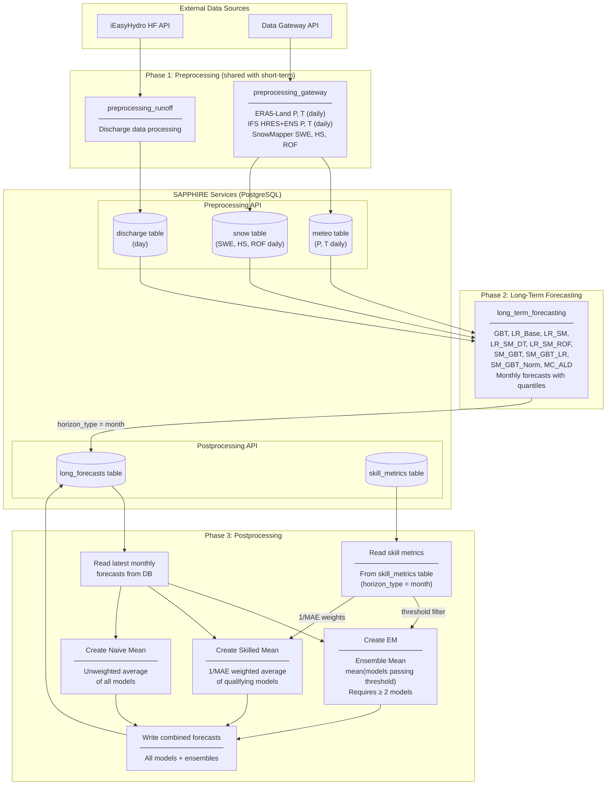
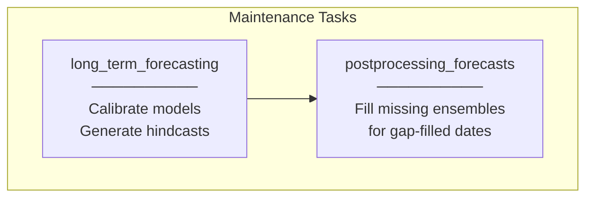
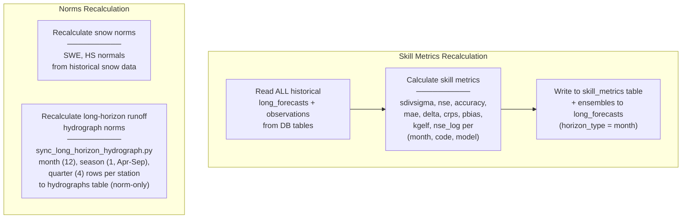

# Long-Term Forecast Pipeline — Data Flow

This document describes how data flows through the SAPPHIRE long-term forecast
pipeline (monthly horizon). It covers the three workflow types: operational,
maintenance, and annual recalculation.

The codebase is transitioning from CSV-based I/O to API-first with PostgreSQL
backends (SAPPHIRE services). Some read paths still use CSV as primary with API
fallback (e.g., skill metrics in `data_reader.py`, gap detection in
`gap_detector.py`). The target state is API-primary with CSV as backup,
eventually deprecating CSV entirely.

## External Data Sources

The long-term pipeline uses the same external data sources as the short-term
pipeline (see [`doc/data_flow_short_term.md`](data_flow_short_term.md)):

- **iEasyHydro (iEH) HF API**: Operational discharge data.
- **Data Gateway API**: ERA5-Land reanalysis (P, T), IFS HRES/ENS forecasts
  (P, T), SnowMapper (SWE, HS, ROF).

## Operational Workflow

The operational pipeline runs on predefined forecast dates (typically monthly).
It produces forecasts for the next calendar month.

### Phase 1: Preprocessing (shared)

Same as short-term — see [`doc/data_flow_short_term.md`](data_flow_short_term.md).

### Phase 2: Long-Term Forecasting

Entry point: `long_term_forecasting/run_forecast.py`

The module reads discharge, meteo, and snow data from the preprocessing DB,
runs all configured models, and writes results to the `long_forecasts` table.

| Model | Type | Description |
|-------|------|-------------|
| `LR_Base` | Linear Regression | Baseline linear model |
| `LR_SM` | Linear Regression | LR with static features + meteo |
| `LR_SM_DT` | Linear Regression | LR + static + meteo + discharge trend |
| `LR_SM_ROF` | Linear Regression | LR + static + meteo + runoff fraction |
| `GBT` | Gradient Boosting | Gradient boosting tree |
| `SM_GBT` | Gradient Boosting | Static + meteo + GBT |
| `SM_GBT_LR` | Gradient Boosting | SM_GBT with LR features |
| `SM_GBT_Norm` | Gradient Boosting | SM_GBT normalized |
| `MC_ALD` | Deep Learning | Monte Carlo with uncertainty quantification |

Models execute in dependency order (e.g., `SM_GBT` depends on `LR_Base`
output). Each forecast includes a full quantile distribution (q05–q95) and
a validity period (`valid_from`, `valid_to`).

### Phase 3: Postprocessing

Entry point: `postprocessing_forecasts/postprocessing_operational_long_term.py`

1. **Read forecasts**: Read the latest monthly forecasts from `long_forecasts`
   table.
2. **Read skill metrics**: Read pre-calculated monthly skill metrics from
   `skill_metrics` table (`horizon_type = month`).
3. **Create ensembles**:

| Ensemble | Method | Threshold | Description |
|----------|--------|-----------|-------------|
| **EM** (Ensemble Mean) | Arithmetic mean | sdivsigma, accuracy, nse | Mean of models passing skill filter (≥ 2 required) |
| **Skilled Mean** | 1/MAE weighted mean | sdivsigma, accuracy | Weighted average using inverse MAE as weights |
| **Naive Mean** | Arithmetic mean | None | Simple average of all available models |

4. **Write**: All models + ensembles back to `long_forecasts` table.

## Maintenance Workflow

Runs after the operational pipeline. Fills gaps in historical data.

| Task | Entry Point | Purpose |
|------|-------------|---------|
| Calibrate + hindcast | `long_term_forecasting/calibrate_and_hindcast.py` | Train models on historical data, generate hindcasts |
| Fill ensembles | `postprocessing_forecasts/postprocessing_maintenance_long_term.py` | Create EM/Skilled Mean/Naive Mean for gap-filled dates |

The maintenance gap-fill uses `gap_detector.detect_missing_monthly_ensembles()`
to scan the most recent N months (configurable via
`POSTPROCESSING_GAPFILL_WINDOW_MONTHS`, default 3) for `(year, month, code)`
tuples missing ensemble rows (EM, Skilled Mean, Naive Mean). For each gap, it
reads individual model forecasts and skill metrics, creates the missing
ensembles, and merges them back.

Calibration runs yearly (or on demand) and produces hindcasts that are written
to the `long_forecasts` table.

## Annual Recalculation Workflow

Runs once per year (or on demand). Rebuilds skill metrics and norms.

Entry point: `recalculate_skill_metrics.py` (same as short-term, with
`horizon_type = month`).

## Key Data Transformations

### LT Writer (long_term_forecasting module)

Each model writes one row per (station, forecast date, target month):

| Field | Value | Example |
|-------|-------|---------|
| `horizon_type` | `month` (always) | `month` |
| `horizon_value` | Lead time in months | `1` |
| `code` | Station code | `19999` |
| `date` | Forecast issuance date | `2026-02-25` |
| `model_type` | Model name | `GBT` |
| `valid_from` | Target period start | `2026-03-01` |
| `valid_to` | Target period end | `2026-03-31` |
| `q50` | Median forecast | `45.2` |
| `q05`–`q95` | Full quantile distribution | `12.1`–`78.5` |
| `flag` | Status (0=ok, 2=failed) | `0` |

### Long-Horizon Hydrograph Norms (preprocessing)

Entry point: `preprocessing_runoff/sync_long_horizon_hydrograph.py`, run once
per year by `bin/yearly_runoff_hydrograph_aggregation.sh`. The job writes
long-horizon runoff hydrograph norm rows to the preprocessing `hydrographs`
table through the sapphire-api-client (`write_hydrograph`).

QUARTER rows use the same period keys as postprocessing `long_forecasts`
quarter rows so dashboard consumers can join climatology norms to quarterly
forecasts.

| Field | QUARTER value |
|-------|---------------|
| `horizon_type` | `quarter` |
| `code` | Station code, e.g. `19999` |
| `date` | First day of the quarter start month: `YYYY-01-01`, `YYYY-04-01`, `YYYY-07-01`, `YYYY-10-01` |
| `day_of_year` | Leap-aware first-of-quarter day (`1`, `91/92`, `182/183`, `274/275`) |
| `horizon_value` | Quarter number `1`-`4` |
| `horizon_in_year` | Same quarter number `1`-`4` |
| `norm`, `previous`, `current` | Mean of the 3 constituent monthly values; `NULL` if any constituent month is missing or non-finite |
| Stat fields | `NULL` (`count`, `mean`, `std`, `min`, `max`, `q05`-`q95` are not populated) |

MONTH and SEASON rows follow the same norm-only shape. MONTH writes 12 rows per
station; SEASON writes one Apr-Sep row whose `norm`, `previous`, and `current`
values are the all-or-nothing mean of Apr through Sep. QUARTER mirrors the
SEASON all-or-nothing rule. This intentionally differs from postprocessing's
quarterly forecast aggregation, where `QUARTER_MIN_MONTHS = 2` allows a
2-of-3-month tolerance.

Consumer join contract: a future dashboard join between preprocessing QUARTER
hydrograph norms and postprocessing `long_forecasts` QUARTER rows must use
period keys (`code`, `horizon_type`, `horizon_value`), not `date` or
`day_of_year`. Hydrograph norm rows are written for the current target year
only, without historical backfill, while long forecasts span many years. The
`norm` column is climatology; `previous` and `current` are year-specific
aggregates.

Deployment prerequisite: sapphire-api-client must include `quarter` in
`VALID_HORIZONS`, and consumers must re-pin to that client version, before the
quarter write path and dashboard read path work end-to-end. The preprocessing
service enum and Alembic migration that add QUARTER are already shipped.

### Ensemble Creation

| Ensemble | Models | Method | Created In |
|----------|--------|--------|------------|
| **EM** | Models passing skill filter | Arithmetic mean of q50 + quantiles | `ensemble_calculator.py` |
| **Skilled Mean** | Models passing skill filter | 1/MAE weighted mean of q50 + quantiles | `ensemble_calculator.py` |
| **Naive Mean** | All models (no filter) | Arithmetic mean of q50 + quantiles | `ensemble_calculator.py` |

All three ensembles require ≥ 2 contributing models. Single-model groups are
discarded. Ensemble rows include a `composition` field listing the contributing
models.

## Database Tables

| Table | Service | Written By | Unique Constraint |
|-------|---------|-----------|-------------------|
| `long_forecasts` | postprocessing | long_term_forecasting (models), postprocessing (ensembles) | `(horizon_type, horizon_value, code, date, model_type, valid_from, valid_to)` |
| `skill_metrics` | postprocessing | recalculate_skill_metrics | `(horizon_type, code, model_type, date, horizon_in_year)` |
| `discharge` | preprocessing | preprocessing_runoff | per-record |
| `meteo` | preprocessing | preprocessing_gateway | per-record |
| `snow` | preprocessing | preprocessing_gateway | per-record |
| `hydrographs` | preprocessing | preprocessing_runoff | `(horizon_type, code, date)` |

## Differences from Short-Term Pipeline

| Aspect | Short-Term | Long-Term |
|--------|-----------|-----------|
| Horizon types | pentad, decade | Forecasts: month; hydrograph norms: month, season, quarter |
| Output table | `forecasts` + `lr_forecasts` | `long_forecasts` |
| Models | LR, TFT, TiDE, TSMixer | LR_Base, LR_SM, LR_SM_DT, LR_SM_ROF, GBT, SM_GBT, SM_GBT_LR, SM_GBT_Norm, MC_ALD |
| Ensembles | NE, EM | EM, Skilled Mean, Naive Mean |
| Quantiles | q05–q95 stored; currently only q50 used operationally | Full distribution (q05–q95) |
| Model dependencies | Independent | Dependency graph (e.g., SM_GBT depends on LR_Base) |
| Run frequency | Daily | Predefined monthly dates |
| Aggregation step | Day → pentad/decade | Not needed (models output monthly directly) |
