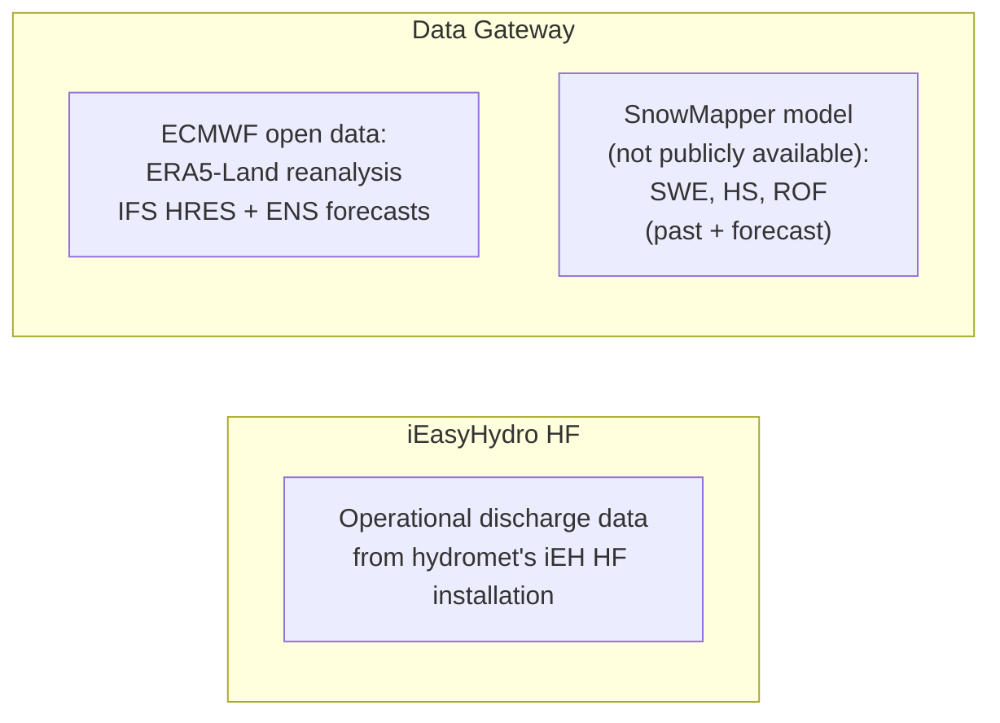
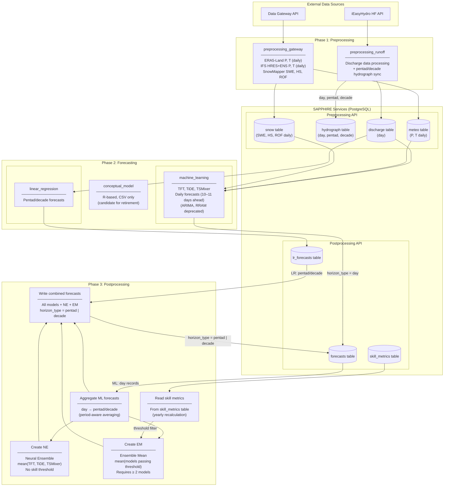
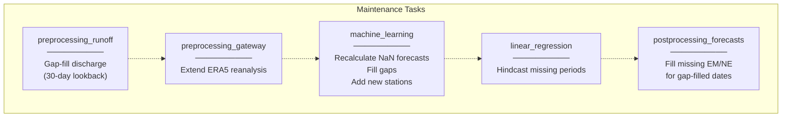
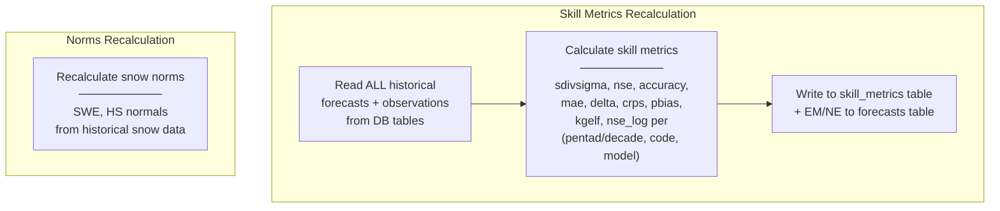

# Short-Term Forecast Pipeline — Data Flow

This document describes how data flows through the SAPPHIRE short-term forecast
pipeline (pentad and decade modes). It covers the three workflow types:
operational (daily), maintenance, and annual recalculation.

The codebase is transitioning from CSV-based I/O to API-first with PostgreSQL
backends (SAPPHIRE services). Some read paths still use CSV as primary with API
fallback (e.g., skill metrics in `data_reader.py`). The target state is
API-primary with CSV as backup, eventually deprecating CSV entirely.

## External Data Sources

- **iEasyHydro (iEH) HF API**: Operational discharge data from the hydromet
  service's installation of the iEasyHydro High Frequency database.
- **Data Gateway API**: Aggregates data from multiple sources:
  - **ECMWF open data**: ERA5-Land reanalysis (P, T) and IFS HRES/ENS
    forecasts (P, T), all daily resolution.
  - **SnowMapper model**: Snow water equivalent (SWE), snow depth (HS), and
    runoff fraction (ROF) — past observations and forecasts. Not publicly
    available.

## Operational Workflow (Daily)

The operational pipeline runs once daily. It produces forecasts for the current
pentad and/or decade period.

### Phase 1: Preprocessing

| Module | Reads From | Writes To | Data |
|--------|-----------|-----------|------|
| `preprocessing_gateway` | Data Gateway API | meteo table, snow table | ERA5-Land P, T; IFS HRES+ENS P, T; SnowMapper SWE, HS, ROF (all daily) |
| `preprocessing_runoff` | iEasyHydro HF API | discharge table, hydrograph (day, pentad, decade) | Daily discharge for all forecast stations; pentad/decade actuals via `sync_short_horizon_hydrograph.py` |

#### Pentad/Decade Actuals (Short-Horizon Hydrograph Sync)

Entry point: `preprocessing_runoff/sync_short_horizon_hydrograph.py`, wired
into `preprocessing_runoff.main()` immediately after the daily hydrograph
write, so it runs on every operational `preprocessing_runoff` run.
`preprocessing_runoff` is the sole writer of pentad/decade hydrograph rows;
`linear_regression` no longer writes to the hydrograph table (see Phase 2
below).

`current` (most recent year) and `previous` (prior year) actuals are each
computed independently:

1. **SDK-first**: read the finalized period average directly from iEasyHydro
   HF — `WDFA` for pentad, `WDDCA` for decade.
2. **Fallback**: if the SDK value is unavailable, average the daily `WDDA`
   values across the calendar period, but only when at least 80% of the
   period's days are present; otherwise the value is `null`.
3. **In-progress guard**: a period that has not yet closed never receives a
   finalized value.

Rows are keyed on the **issue date** — the last day of the *previous* period
(`get_issue_date_from_pentad` / `get_issue_date_from_decad`), matching the LR
issue-date convention described below. Both `current` and `previous` are
rounded with `round_3sf` (see the
[3sf rounding contract](data_flow_long_term.md#discharge-rounding-3sf-contract)
in the long-term data flow doc).

**Scope: actuals only.** The climatology envelope (`mean`, `min`, `max`,
`q05`–`q95`) and `norm` are reproduced by the same legacy method as before
(byte-identical) and are unaffected by this change; `norm` for pentad/decade
still comes from the iEH HF SDK. No forecast predictor, norm, or
skill-metric behavior changes — the LR predictor is read from the
`discharge` table, not `hydrograph`.

### Phase 2: Forecasting

| Module | Reads From | Writes To | Details |
|--------|-----------|-----------|---------|
| `linear_regression` | discharge table | lr_forecasts table | One forecast per pentad/decade per station |
| `machine_learning` | discharge, meteo, snow tables | forecasts table (`horizon_type=day`) | TFT, TiDE, TSMixer; 10–11 daily targets per station |
| `conceptual_model` | CSV files | CSV files | R-based, not yet migrated to DB; candidate for retirement |

> **Note:** The ML module code also contains references to ARIMA and RRAM (RR-Mamba) models. These are deprecated and no longer supported in the operational pipeline.

#### LR Issue-Date Indexing Convention

The LR module indexes training data by the **issue date** (the date the forecast
is produced), not the target period. `get_pentadal_and_decadal_data()` assigns
`pentad_in_year` from each row's own date. A row dated March 25 has
`pentad_in_year = 17`, while its `discharge_avg` column holds the mean discharge
of March 26–31 (the target period, pentad 18).

This means `forecast_horizon_int = 17` (the issue pentad) is the correct filter
key for training data and norm discharge on March 25. **Do not change it to 18.**

The ML pipeline uses a different convention: `horizon_in_year = 18` (the target
pentad). The discrepancy is resolved by a metadata override in
`linear_regression.py` that converts to the target-period convention immediately
before the API write, without changing any upstream computation.

| Layer | LR value | ML value | Convention |
|-------|----------|----------|------------|
| Training data filter | 17 | n/a | Issue-date |
| Norm discharge lookup | 17 | n/a | Issue-date |
| Visibility query | Correct (uses +1 day from issue pentad's last day) | n/a | Issue-date |
| API `horizon_in_year` | 18 (after override) | 18 | Target-date |
| API `horizon_value` | 6 (after override) | 6 | Target-date |

### Phase 3: Postprocessing

1. **Read and aggregate**: The postprocessing module's data reading phase
   (via `setup_library.py`) reads ML daily forecasts from the forecasts
   table and aggregates them to pentad/decade (period-aware: only targets
   within the period boundary). LR forecasts are read from lr_forecasts
   table (already at pentad/decade level).
2. **Create NE**: During data reading, `setup_library.py` averages
   TFT + TiDE + TSMixer (no skill threshold). Consider moving this method
   to the postprocessing module where it is exclusively used.
3. **Create EM**: Read yearly skill metrics from skill_metrics table, filter
   models by threshold (sdivsigma, accuracy), average qualifying models
   (≥ 2 required).
4. **Write**: All models + NE + EM to forecasts table with
   `horizon_type = pentad | decade`.

## Maintenance Workflow

Runs after the daily operational pipeline. Fills gaps in historical data.

> **Note:** These are currently individual scripts, not a single orchestrated
> pipeline. The diagram shows logical dependency order. Future work may
> collect them into a unified maintenance pipeline.

| Task | Module | Purpose |
|------|--------|---------|
| Gap-fill discharge | `preprocessing_runoff --maintenance` | Fill missing daily discharge (30-day lookback) |
| Extend reanalysis | `preprocessing_gateway` | Extend ERA5 data if gaps exist |
| Recalculate NaN | `machine_learning/recalculate_nan_forecasts.py` | Re-run ML models for dates with flag=1 (NaN) |
| Fill ML gaps | `machine_learning/fill_ml_gaps.py` | Fill missing forecast dates |
| Add new stations | `machine_learning/add_new_station.py` | Generate hindcasts for newly added stations |
| LR hindcast | `linear_regression` | Produce LR forecasts for missing dates |
| Fill ensembles | `postprocessing_forecasts/postprocessing_maintenance.py` | Create EM/NE for gap-filled dates |

## Annual Recalculation Workflow

Runs once per year (or on demand). Rebuilds skill metrics and norms from all
historical data.

### Skill Metrics

Entry point: `recalculate_skill_metrics.py`

The `date` field in the skill_metrics table is the **forecast date** (pentad/decade
boundary date for the target year), not the date the calculation was run.

### Norms

Entry point:
- **Snow norms**: `preprocessing_gateway/recalculate_snow_norms.py` recalculates
  SWE/HS normals from the full historical snow record.

## Key Data Transformations

### ML Writer (machine_learning module)

The ML module always writes **daily-resolution** forecasts:

| Field | Value | Example |
|-------|-------|---------|
| `horizon_type` | `day` (always) | `day` |
| `date` | forecast boundary date | `2026-02-25` |
| `target` | individual day being forecast | `2026-02-26` |
| `model_type` | `TFT`, `TiDE`, `TSMixer` | `TFT` |
| `forecasted_discharge` | Q50 quantile | `3.30` |

For a pentad forecast produced on Feb 25, the ML writer creates **6 rows** per
station (one per daily target: Feb 26 through Mar 3). Only the targets within
the current pentad are used for aggregation.

### Aggregation: Day → Pentad/Decade

The postprocessing module aggregates daily ML targets to the pentad/decade
level, respecting variable period lengths:

1. Read DAY records from forecasts table for each ML model
2. Determine which targets belong to the current pentad/decade
   - Pentad 6 of February: days 26–28 (3 days)
   - Decade 3 of February: days 21–28 (8 days)
3. Average only the targets within the period
4. Result: one row per (code, date, model_short) at pentad/decade level

Step 1 reads a *merged* archive: the DAY records plus, for dates before each
(code, model)'s first DAY issue date, retained rows from the migrated period
archive. The merge retains what already exists — it does not synthesise a row for
a date that was never written.

### Recovery: stranded period rows

Period rows are written on the daily/boundary-day cadence only by the operational
path, so a missed boundary day strands them, and maintenance cannot heal a date
that has no `combined` rows to discover. The recovery tool is
`postprocessing_forecasts/backfill_period_forecasts.py`, which re-runs this same
aggregation over a chosen range, one calendar year per internal call.

It re-aggregates existing inputs and cannot invent them: when the pipeline never ran,
there is nothing at step 1 for those dates. The run then writes nothing *new for them*
while still re-upserting the rest of that year, and exits 0 — or exits 1 if the whole
horizon-year is empty. Neither outcome is a repair. Establish coverage before using
it — procedure in
[`doc/prod/backfill_period_forecasts_runbook.md`](prod/backfill_period_forecasts_runbook.md).

### Ensemble Creation

| Ensemble | Models | Threshold | Created In |
|----------|--------|-----------|------------|
| **NE** (Neural Ensemble) | TFT + TiDE + TSMixer | None (always created) | `setup_library.py` |
| **EM** (Ensemble Mean) | All models passing skill filter | sdivsigma < threshold, accuracy > threshold | `ensemble_calculator.py` |

EM requires **≥ 2 qualifying models** per (date, code). Single-model
"ensembles" are discarded. Thresholds are configured via environment variables
(`ieasyhydroforecast_efficiency_threshold`, `ieasyhydroforecast_accuracy_threshold`).

## Database Tables

| Table | Service | Written By | Unique Constraint |
|-------|---------|-----------|-------------------|
| `forecasts` | postprocessing | ML writer (day), postprocessing (pentad/decade) | `(horizon_type, code, model_type, date, target)` |
| `lr_forecasts` | postprocessing | linear_regression | `(horizon_type, code, date)` |
| `skill_metrics` | postprocessing | recalculate_skill_metrics | `(horizon_type, code, model_type, date, horizon_in_year)` |
| `meteo` | preprocessing | preprocessing_gateway | per-record |
| `snow` | preprocessing | preprocessing_gateway | per-record |
| `discharge` | preprocessing | preprocessing_runoff | per-record |
| `hydrograph` | preprocessing | preprocessing_runoff | per-record |

## Pentad / Decade Period Definitions

| Period | Days in Month |
|--------|--------------|
| Pentad 1 | 1–5 |
| Pentad 2 | 6–10 |
| Pentad 3 | 11–15 |
| Pentad 4 | 16–20 |
| Pentad 5 | 21–25 |
| Pentad 6 | 26–end of month (variable: 3–6 days) |

| Period | Days in Month |
|--------|--------------|
| Decade 1 | 1–10 |
| Decade 2 | 11–20 |
| Decade 3 | 21–end of month (variable: 8–11 days) |

### Boundary Dates and the +1 Day Shift

The table below shows which calendar day triggers each forecast and which
period that forecast covers.

| Trigger date (issue date) | Pentad being forecast    | Decade being forecast    |
|---------------------------|--------------------------|--------------------------|
| Last day of month         | 1st (next month)         | 1st (next month)         |
| 5th                       | 2nd                      | —                        |
| 10th                      | 3rd                      | 2nd                      |
| 15th                      | 4th                      | —                        |
| 20th                      | 5th                      | 3rd                      |
| 25th                      | 6th                      | —                        |

The trigger date (also called the issue date) is the last day of the
*outgoing* period; the forecast itself covers the *upcoming* period.
The base helper functions in `tag_library.py` (`get_pentad`,
`get_pentad_in_year`, etc.) use the formula `(day - 1) // 5 + 1`, which
maps a given day to the period that *contains* it (i.e. the closing
period). To obtain the label of the *next* (target) period, downstream
code adds `+ pd.Timedelta(days=1)` before calling these helpers,
advancing the issue date to the first day of the upcoming period and
yielding the correct target-period label. This +1 day shift appears in
`data_reader.py`, `setup_library.py`, and `forecast_library.py`.

> **Note:** Day-of-month gating (whether today is a boundary day) happens
> inside Python (`ForecastFlags.from_forecast_date_get_flags()` in
> `setup_library.py`). The cron job and `run_locally.sh` fire every day;
> non-boundary days are no-ops.
