# SAPPHIRE Forecast Pipeline Documentation

## Overview

The SAPPHIRE Forecast Tools use a Luigi-based pipeline to orchestrate complex hydrological forecasting workflows. The pipeline consists of multiple workflows that run at different times based on data availability:

1. **Preprocessing Gateway Workflow** - Runs at 04:00 UTC for meteorological data
2. **Preprocessing Runoff Workflow** - Runs at 10:00-11:00 local time when discharge data is available
3. **Pentadal Forecast Workflow** - Runs after both preprocessing workflows complete
4. **Decadal Forecast Workflow** - Runs after both preprocessing workflows complete

## Workflow Architecture

### Complete Pipeline Overview


### Workflow 1: Preprocessing Gateway (04:00 UTC)


### Workflow 2: Preprocessing Runoff (10:00-11:00 Local)


### Workflow 3: Pentadal Forecasts


### Workflow 4: Decadal Forecasts


## Execution Timeline


## Workflow Dependencies


## Workflow Configurations

### Organization-Specific Model Selection

| Organization | Pentadal Models | Decadal Models |
|--------------|-----------------|----------------|
| **demo** | Linear Regression | Linear Regression |
| **kghm** | Linear Regression<br>Conceptual Model<br>All ML Models | Linear Regression<br>Conceptual Model<br>All ML Models |
| **tjhm** | Linear Regression<br>All ML Models | Linear Regression<br>All ML Models |

### Workflow Triggers

```yaml
# Cron expressions for workflow scheduling
workflows:
  preprocessing_gateway:
    schedule: "0 4 * * *"  # 04:00 UTC daily
    timezone: "UTC"
    
  preprocessing_runoff:
    schedule: "0 10 * * *"  # 10:00 local time
    timezone: "Local"
    condition: "data_available"
    
  pentadal_forecasts:
    trigger: "on_dependencies_complete"
    dependencies: ["preprocessing_gateway", "preprocessing_runoff"]
    
  decadal_forecasts:
    trigger: "on_dependencies_complete"
    dependencies: ["preprocessing_gateway", "preprocessing_runoff"]
```

## Data Flow Between Workflows


## Implementation Examples

### Luigi Task for Checking Dependencies

```python
class CheckPreprocessingComplete(luigi.Task):
    """Check if both preprocessing workflows have completed"""
    
    def requires(self):
        return {
            'gateway': PreprocessingGatewayComplete(),
            'runoff': PreprocessingRunoffComplete()
        }
    
    def run(self):
        # Both preprocessing tasks are complete
        with self.output().open('w') as f:
            f.write('Prerequisites complete')
```

### Workflow Orchestration

```python
class RunPentadalForecasts(luigi.Task):
    """Orchestrate pentadal forecast workflow"""
    
    def requires(self):
        # First check if preprocessing is complete
        yield CheckPreprocessingComplete()
        
        # Then run models based on organization
        if ORGANIZATION == 'kghm':
            yield LinearRegression(prediction_mode='PENTAD')
            yield ConceptualModel(prediction_mode='PENTAD')
            yield RunAllMLModels(prediction_mode='PENTAD')
        elif ORGANIZATION == 'tjhm':
            yield LinearRegression(prediction_mode='PENTAD')
            yield RunAllMLModels(prediction_mode='PENTAD')
        else:  # demo
            yield LinearRegression(prediction_mode='PENTAD')
    
    def run(self):
        # Run postprocessing
        yield PostProcessingForecasts(prediction_mode='PENTAD')
        yield SendNotification(message='Pentadal forecasts complete')
```

## Monitoring and Status

### Workflow Status Dashboard

```mermaid
graph LR
    subgraph Status Indicators
        S1[🟢 Complete]
        S2[🟡 Running]
        S3[🔴 Failed]
        S4[⏸️ Waiting]
    end
    
    subgraph Today's Status
        GW[Gateway<br>🟢 04:30]
        RO[Runoff<br>🟡 10:15]
        PF[Pentadal<br>⏸️ Waiting]
        DF[Decadal<br>⏸️ Waiting]
    end
```



### Key Metrics to Monitor

1. **Preprocessing Completion Times**
   - Gateway workflow duration
   - Runoff workflow duration
   - Time between trigger and completion

2. **Model Execution Times**
   - Individual model runtimes
   - Parallel execution efficiency
   - Resource utilization

3. **Data Quality Indicators**
   - Missing data points
   - Data validation failures
   - Forecast quality metrics

## Error Handling Across Workflows


## Best Practices

1. **Dependency Management**
   - Always check preprocessing completion before running forecasts
   - Use file markers or database flags to track workflow status
   - Implement proper timeout handling for long-running tasks

2. **Scheduling Considerations**
   - Account for time zone differences (UTC vs local)
   - Build in buffer time for data availability delays
   - Consider holidays and weekends for operational data entry

3. **Resource Optimization**
   - Run independent workflows in parallel
   - Stagger resource-intensive tasks
   - Clean up intermediate data regularly

4. **Monitoring and Alerts**
   - Set up alerts for workflow failures
   - Monitor preprocessing completion times
   - Track forecast quality metrics